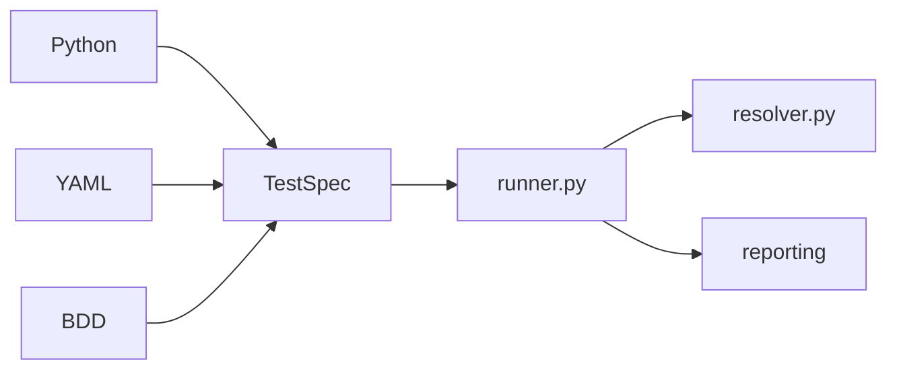

<div align="center">
  
</div>

A project exploring **capability-driven test execution**: tests declare what they need (`api`, `browser`, `secrets`), configuration selects implementations, and a minimal runner handles collection, resolution, injection, and teardown.

This is not a pytest replacement, enterprise governance layer, or plugin marketplace — yet. Today it is a working execution engine you can run locally.

## Status

| Area | State |
|------|-------|
| Execution engine | Working — `velaris run` |
| Capabilities | `api`, `secrets`, `browser`, `target_environment` + external plugins |
| Authoring | Python, YAML, minimal BDD (`.feature`) → TestSpec |
| Reporting | Default ✓/✗ stdout, `--verbose` / `--debug`, JSON log, static HTML report |
| Plugin bootstrap | Manual — `velaris_plugins.py` from cwd |
| Plugin discovery | Not implemented |

**108 tests passing** across `velaris-contracts` and `velaris-core`.

## Install

From the repository root:

```bash
python -m venv .venv
source .venv/bin/activate
pip install -e packages/velaris-contracts -e "packages/velaris-core[dev]"
```

The `velaris` CLI is provided by `velaris-core`.

## Run

Start with the browser example (passes out of the box):

```bash
cd examples/browser
velaris run tests/ --config velaris.fake.toml
```

Example output:

```text
✓ test_login

Passed: 1
Failed: 0
Duration: 0.00s
```

Generate an HTML report in one command:

```bash
velaris run tests/ --config velaris.fake.toml --html-report
open report.html
```

See [examples/authoring/](examples/authoring/) for Python, YAML, and BDD writing the same test.

**Note:** `examples/minimal` requires `API_TOKEN` and HTTP mocking. Use browser or [stress-test](examples/stress-test/) first.

## Provider swap

Same test, different config — no test code changes:

```bash
cd examples/minimal
API_TOKEN=swap-demo-token velaris run tests/test_token.py --config velaris.env-secrets.toml
velaris run tests/test_token.py --config velaris.static-secrets.toml
```

## Configuration

`velaris.toml` binds capabilities to providers:

```toml
[capabilities.api]
provider = "requests"

[capabilities.api.options]
base_url = "http://testserver"

[capabilities.secrets]
provider = "env"
```

## Write a test

```python
from velaris_core.decorators import test

@test("browser")
def test_login(browser):
    browser.open("/login")
    browser.type("#username", "demo")
    browser.click("#submit")
```

`@test("capability", ...)` declares required capabilities explicitly. Parameter names must match capability IDs.

## Architecture

```text
Authoring (Python / YAML / BDD)
        ↓
   Adapters → TestSpec IR
        ↓
   Resolver → Runner → Events → Reporters (stdout / JSON / HTML)
```



## Repository layout

```text
velaris/
├── packages/
│   ├── velaris-contracts/   # Capability Protocols
│   └── velaris-core/        # Runner, resolver, adapters, CLI, HTML report
├── examples/
│   ├── README.md          # Recommended order + cwd rules
│   ├── browser/           # First run (recommended)
│   ├── authoring/         # Python + YAML + BDD
│   ├── stress-test/       # External capabilities
│   └── plugins/           # Plugin SDK demo
└── docs/                  # VitePress site + milestone reports
```

## Development

```bash
pytest   # from repo root (see pyproject.toml testpaths)
```

## Documentation

Full documentation site (VitePress):

```bash
npm install
npm run docs:dev    # http://localhost:5173
npm run docs:build
```

- [docs/](docs/) — VitePress site source
- [Alpha scope](docs/alpha-scope.md) — v0.1.0-alpha limitations
- [docs/roadmap.md](docs/roadmap.md) — milestone history
- [HTML Report](docs/html-report.md) — static report from JSON logs

## License

MIT
