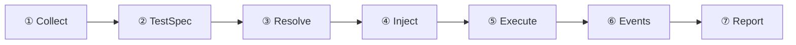
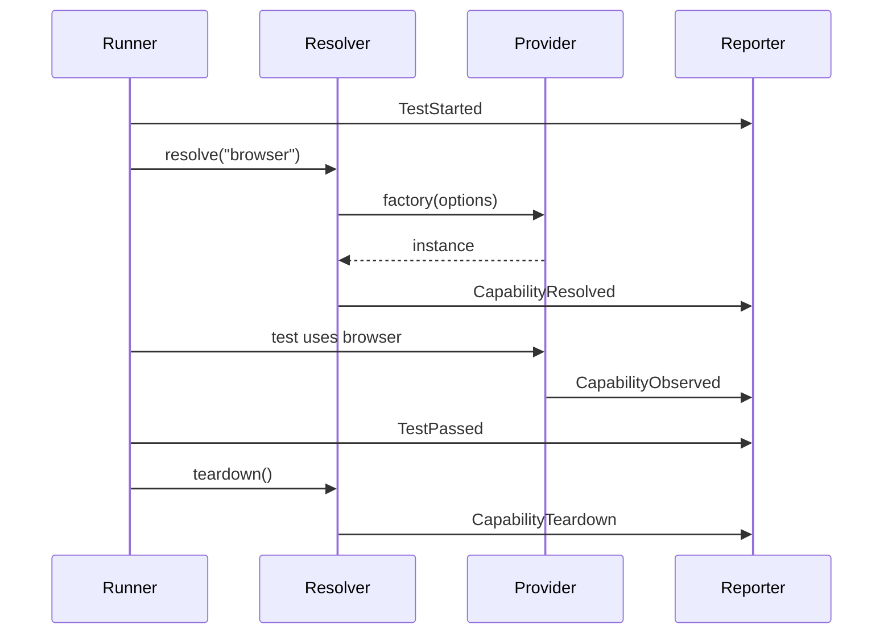
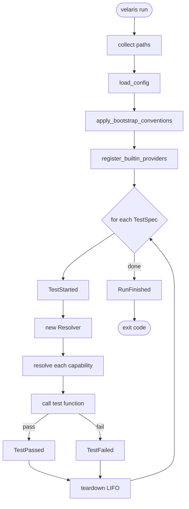

# Execution Pipeline

Every `velaris run` follows the same pipeline:



## ① Collect

`collector.py` dispatches each file to an authoring adapter (Python, YAML, or BDD).

```python
# Python: tests/test_login.py
@test("browser")
def test_login(browser): ...
```

```yaml
# YAML: tests/test_login.yaml
name: test_login_yaml
capabilities: [browser]
actions: [browser.open("/login")]
```

All adapters produce the same `TestSpec` shape.

## ② TestSpec

Validated IR passed to the runner:

```python
TestSpec(name="test_login", capabilities=["browser"], callable=...)
```

Duplicate names and parameter mismatches fail here.

## ③ Resolve

For each capability in the TestSpec:

1. Load binding from `velaris.toml` → `(provider, options)`
2. Look up factory in registry → `registry.get_factory("browser", "fake")`
3. Call factory with options + emit callback
4. Cache instance for this test scope

With `--verbose` or `--debug`, resolution is printed:

```text
RESOLVE browser(fake)
```

(Default stdout omits this — see [CLI UX redesign](/cli-ux-redesign).)

## ④ Inject

Build kwargs from resolved instances:

```python
kwargs = {cap: resolver.resolve(cap) for cap in spec.capabilities}
spec.callable(**kwargs)
```

Parameter names must match capability IDs.

## ⑤ Execute

Run the test function. Catch:

- `AssertionError` → `TestFailed`
- Any other exception → `TestFailed`

Always run `resolver.teardown()` in `finally` (LIFO).

## ⑥ Events

Every stage emits events through `EventEnvelope`:



## ⑦ Report

`multiplex()` fans out to all reporters:

- **StdoutReporter** — always active (default / `--verbose` / `--debug` modes)
- **JsonReporter** — when `--json-log` or `--html-report` is set
- **HTML generator** — after run when `--html-report`, or via `velaris report`

Session ends with `RunFinished` (pass/fail counts, duration).

## Full run diagram



## What the runner does not do

- Import provider modules directly (bootstrap only)
- Build capability dependency graphs
- Share instances across tests
- Parse YAML or Gherkin
