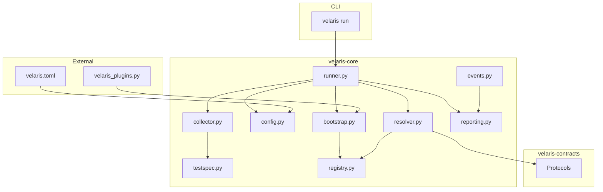

# Architecture Overview

Velaris is a capability-driven testing framework built as two Python packages and a thin CLI.

## Design principles

1. **Tests declare, config selects** — no hardcoded implementations in tests
2. **Runner knows bootstrap, not providers** — `runner.py` never imports provider modules
3. **TestSpec boundary** — execution engine is format-agnostic
4. **Model A** — capabilities are independent; no dependency graph in the resolver
5. **Events everywhere** — resolution, observations, and lifecycle are observable

## Module map

| Module | Responsibility |
|--------|----------------|
| `cli.py` | `velaris run`, `velaris report`, exit codes |
| `collector.py` | Adapter dispatcher → TestSpec |
| `adapters/` | Python, YAML, BDD → TestSpec |
| `runner.py` | Orchestration loop |
| `resolver.py` | Per-test resolve + LIFO teardown |
| `registry.py` | `(capability, provider) → factory` |
| `bootstrap.py` | Built-in + manual plugin registration |
| `config.py` | TOML loading and validation |
| `compose.py` | Optional config merge conventions |
| `sdk.py` | Public plugin author API |

## Topics

- [Execution Pipeline](/architecture/execution-pipeline) — Collect → Report
- [Packages](/architecture/packages) — velaris-core vs velaris-contracts
- [Model A Composition](/architecture/model-a) — combining independent capabilities
