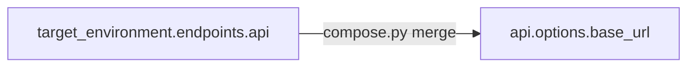

# Model A Composition

**Model A:** capabilities are independent. The resolver provides `resolve(capability_id)` — nothing else. No dependency graphs, no factory-to-factory wiring.

## What this means

```python
@test("api", "secrets", "target_environment")
def test_compose(api, secrets, target_environment):
    base = target_environment.endpoint("api").rstrip("/")
    token = secrets.get("API_TOKEN")
    response = api.get(f"{base}/orders", headers={"Authorization": f"Bearer {token}"})
    assert response.status_code == 200
```

The test composes three **independent** instances in Python. The resolver did not pass data between factories.

## Three composition styles

Velaris supports three places to wire capabilities — all without resolver changes.

### 1. Test code

Declare all capabilities; wire in the function body.

| Pros | Cons |
|------|------|
| Fully explicit | Verbose if repeated |
| Easy to debug | Authors need all contracts |

### 2. Configuration

Set values directly in `velaris.toml`:

```toml
[capabilities.api.options]
base_url = "https://api.example.com"

[capabilities.target_environment.options.endpoints]
api = "https://api.example.com"
```

| Pros | Cons |
|------|------|
| Simple tests | Duplication across keys |

### 3. Bootstrap convention

`compose.apply_bootstrap_conventions()` copies `target_environment.endpoints.api` → `api.options.base_url` when `base_url` is unset.

| Pros | Cons |
|------|------|
| Single URL source in config | Convention is implicit |



Test can declare only `@test("api", "secrets")` — `target_environment` affects config only.

## Where composition does NOT belong

| Layer | Avoid |
|-------|-------|
| Resolver | Passing instances between capabilities |
| Registry | Declaring capability dependencies |
| Provider factories | Importing other capability instances |

## Example

See [Composition example](/examples/composition) for three runnable tests demonstrating each style.
