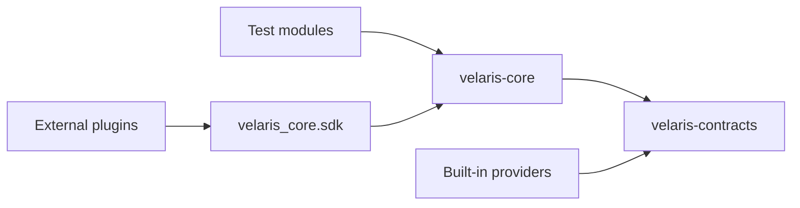

# Packages

Velaris splits into two installable Python packages.

## velaris-contracts

**Versioned capability Protocols.** No runtime dependencies.

```text
velaris_contracts/
├── api/v0_1.py          # ApiClient, Response
├── secrets/v0_1.py      # Secrets
├── browser/v0_1.py      # Browser
└── target_environment/v0_1.py
```

Import for typing and provider compliance:

```python
from velaris_contracts.api.v0_1 import ApiClient
from velaris_contracts.secrets.v0_1 import Secrets
```

Contracts define **what** tests can call. They do not execute anything.

## velaris-core

**Execution engine, registry, resolver, CLI, built-in providers.**

```text
velaris_core/
├── cli.py               # velaris command
├── runner.py            # execution loop
├── collector.py         # Python adapter
├── testspec.py          # TestSpec IR
├── resolver.py          # injection + teardown
├── registry.py          # provider map
├── bootstrap.py         # registration entry point
├── config.py            # velaris.toml
├── compose.py           # config merge conventions
├── sdk.py               # plugin author API
├── events.py            # event types
├── reporting.py         # Reporter protocol
├── providers*.py        # built-in factories
└── plugin_loader.py     # velaris_plugins.py
```

## Dependency direction



- Tests import `velaris_core.decorators`
- Providers import contracts + `velaris_core.sdk`
- Runner imports bootstrap, never individual providers
- External contracts stay in plugin packages (not required in velaris-contracts)

## Repository layout

```text
velaris/
├── packages/
│   ├── velaris-contracts/
│   └── velaris-core/
├── examples/            # runnable demos
├── docs/                # this site
└── package.json         # VitePress tooling
```

## Public APIs

| Audience | Import from |
|----------|-------------|
| Test authors | `velaris_core.decorators` |
| Plugin authors | `velaris_core.sdk` |
| Contract consumers | `velaris_contracts.*.v0_1` |
| Advanced / internal | `velaris_core.runner`, `velaris_core.resolver` |

Plugin authors should not need to import runner or resolver.
