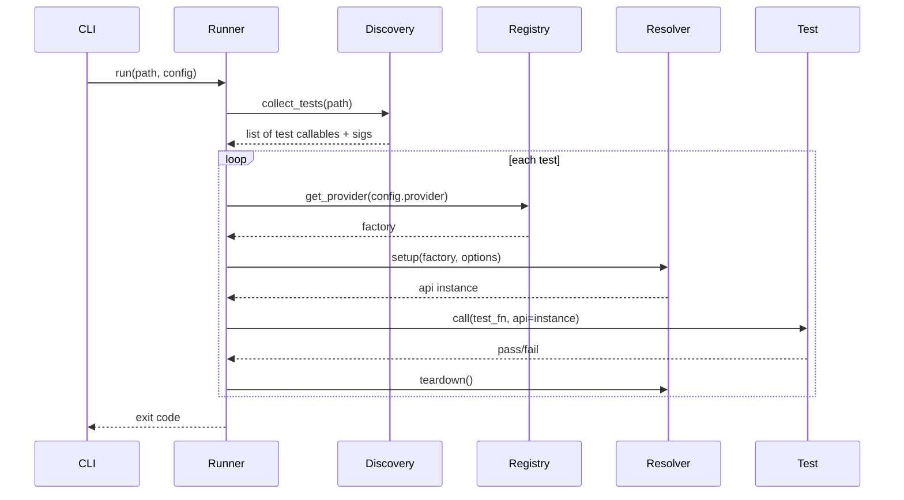

# Velaris Architecture Stress Test

| Field | Value |
|-------|-------|
| Status | Complete |
| Created | 2026-06-02 |
| Scope | Pre–Phase 1 gate review |
| Documents reviewed | RFC-001, RFC-002, RFC-006, api@0.1 |

**Verdict preview:** The capability thesis is plausible but unproven. The current RFC set describes a Phase 4+ system while calling Phase 1 the next step. Several contradictions must be resolved before building a full runner.

---

## 1. Architecture Review Report

### 1.1 Contradictions between RFCs

#### RFC-001 vs RFC-002

| # | Contradiction | Details |
|---|---------------|---------|
| C1 | **Contract version authority** | RFC-001 (Open Question #1) proposes config pins contract version; IR stores resolved version at collection. RFC-002 examples always embed `"contract": "api@0.1"` in IR regardless of config. Unclear what happens when a test imports `ApiClient` from `v0_1` but config specifies `contract = "1.0"`. Collection, typing, and runtime could disagree silently. |
| C2 | **Capability detection requires frozen registry** | RFC-001 says registry freezes before collection. RFC-002 detection rule #2 uses "parameter name matching a registered capability ID" — collection depends on plugin registration order and loaded plugins. Rule #1 uses Protocol imports from contract packages — a parallel detection path that does not need the registry. Two detection paths with different prerequisites will diverge. |
| C3 | **Scope defaults** | RFC-001: default scope is declared by the provider; tests may narrow. RFC-002 examples always set `"scope": "test"` explicitly in IR. If IR always materializes scope, provider defaults become dead code in the Python path. |
| C4 | **IR as source of truth vs live signature** | IR stores `required_capabilities` and `executable.kind = python_callable`. Execution still requires importing the callable and binding its full signature. RFC-002 Example 4 adds `path` and `expected_status` as parametrized values but does not specify how non-capability parameters are injected. Either the engine re-inspects the signature at runtime (IR incomplete) or IR must carry full parameter binding (not specified). |
| C5 | **Step scope exists but is unused** | RFC-001 defines a `step` capability scope. RFC-002 states Python `velaris.step()` is runtime reporting only, not IR. No authoring format uses step-scoped capabilities in Phase 1–2. Dead complexity. |
| C6 | **Unknown capability handling** | RFC-002 validator: unknown capability IDs → warning at collect, error at run. RFC-001: missing provider → error at session start. These are different gates; a test could collect with warnings and fail before any test runs, or fail mid-session depending on implementation order. |

#### RFC-001 vs RFC-006

| # | Contradiction | Details |
|---|---------------|---------|
| C7 | **Mode C reintroduces rejected alternative** | RFC-001 Alternative 1 ("Capabilities as pytest fixture aliases") is **Rejected** because it "loses fail-fast ambiguity detection, config-only binding, and contract versioning." RFC-006 Mode C (`capability_fixture("api")`) is exactly this pattern, later endorsed as a valid pivot and migration end state. The RFCs disagree on whether the pytest-bridge path is architectural defeat or success. |
| C8 | **Value delivery order** | RFC-006 Stage 1 says extract contract packages and refactor fixtures **without a runner change** — low effort, immediate value. The phased roadmap builds a full Velaris runner in Phase 1 before the capability system in Phase 2. Stage 1 value can be delivered before any Velaris code exists; the roadmap does not prioritize it. |
| C9 | **Shared infrastructure diagram** | RFC-006 diagram shows pytest → CapContracts. Mode C is Phase 3+. Stage 1 (contracts only) does not require Velaris runner, but the diagram implies both tools consume the same infrastructure equally — overstated for Phase 1–2. |
| C10 | **Profile/config duplication** | RFC-001 profiles live in `velaris.toml`. RFC-006 Mode A uses separate pytest and Velaris configs with no shared binding layer. Mode C reads `velaris.toml` from pytest — but then pytest and Velaris runners need duplicate profile maintenance unless one is canonical. Not specified. |

#### RFC-002 vs RFC-006

| # | Contradiction | Details |
|---|---------------|---------|
| C11 | **Marker/tag mapping** | RFC-006 feature parity table says `@pytest.mark.*` maps to `@velaris.tag` "in adapter." No RFC defines this adapter. RFC-002 defines only `@velaris.tag`. |
| C12 | **IDE discovery** | RFC-006 claims Mode B preserves pytest IDE integration. RFC-002 requires Velaris-native tests using `@velaris.tag`, `velaris.step`, and capability params — not discoverable as pytest tests without the bridge. Side-by-side Mode A gives developers no IDE integration for Velaris tests unless they add a pytest plugin or custom IDE config. |

### 1.2 Unvalidated assumptions

| Assumption | Risk if wrong |
|------------|---------------|
| Platform teams routinely swap HTTP clients (httpx ↔ requests) | Swap demo proves nothing teams care about; they pick one library |
| Teams accept a second test runner in CI | Adoption stops at Mode C or internal pytest plugin |
| Separate `velaris-contract-*` packages will be published and reused across orgs | Contracts stay internal monolith packages; no interchange |
| Protocol typing gives acceptable IDE experience | Developers lose autocomplete unless they import contract packages anyway |
| `requires: ["network"]` models real dependencies | No-op stub misleads authors about resolver power; real network capability later breaks providers |
| Full JSON IR is needed before parallel execution | Phase 1–3 carry IR serialization cost for a feature 4 phases away |
| Parametrized capability matrix (`httpx` AND `requests` in one run) is needed | pytest `@pytest.fixture(params=...)` already does this; Velaris defers to Phase 3 |
| External design partners will validate RFC-001 | Outreach plan shows 0 contacts, 0 reviews — exit criteria unmet |
| Browser contract will be as clean as api@0.1 | Browser capability will explode complexity (waits, frames, mobile contexts) |
| YAML/BDD IR (Example 5) aligns with Python path | Step registry + keyword mapping is Robot Framework redux; untested |

### 1.3 Over-engineered concepts (for pre–Phase 1)

| Concept | Why it is premature |
|---------|---------------------|
| **Full TestSpec IR v1.0 with 5 executable kinds** | Only `python_callable` needed for 12+ months of value |
| **Four capability scopes including `step`** | MVP needs `test` scope only |
| **Separate installable contract packages** | MVP can inline Protocol; extract when two orgs actually share contracts |
| **`metadata.json` per contract** | Protocol + constants sufficient until tooling exists |
| **Compatibility matrix per plugin** | Zero plugins published |
| **Capability profiles** | Environment vars + single config section sufficient initially |
| **TestCandidate → Compiler → Validator → Normalizer pipeline** | Four stages for "find `test_*` functions" |
| **`worker_safe` registration flag** | Phase 5 concern polluting Phase 0 design |
| **Contract semver deprecation policy** | No users to deprecate |
| **Plugin system with entry points before two hardcoded providers** | Entry points add indirection before proving swap works |

### 1.4 Under-specified concepts (will cause implementation thrash)

| Gap | Impact |
|-----|--------|
| **Non-capability parameter binding** | Parametrize, regular args, and capabilities in one signature — core execution undefined |
| **Collection vs plugin load order** | Cannot implement RFC-002 detection rule #2 without specifying this |
| **Protocol → capability ID registry** | `ApiClient` Protocol maps to `api` how? By import path convention? By `CAPABILITY_ID` constant scan? |
| **Module import isolation** | "Plugin-mediated import" mentioned once; no spec for sys.path, conftest, import side effects |
| **Velaris equivalent of conftest.py** | Hierarchical shared setup across test directories undefined |
| **Conflict when param named `api` but type hint is wrong** | Name-based vs type-based detection precedence |
| **Auth config schema** | api@0.1 lists `auth` object but types/validation deferred to providers — cross-provider inconsistency |
| **Redirect following, cookies, sessions** | Real API tests need these; contract silent |
| **Error taxonomy** | Test failure vs capability setup failure vs collection error — no unified spec |
| **RFC-003/004/005 missing** | Plugin API, config schema, reporting referenced but undefined; Phase 1 will invent ad hoc |

---

## 2. Capability Model Challenge

### 2.1 Comparison matrix

| Dimension | pytest fixtures | DI container | Service locator | Plugin system (pluggy) | Velaris capabilities |
|-----------|-----------------|--------------|-----------------|------------------------|----------------------|
| **Injection style** | Parameter name = fixture name | Constructor/setter injection | `get("service")` lookup | Hook implementations | Parameter name = capability ID |
| **Lifetime** | function/module/session scopes | Container scopes | Varies | N/A | session/module/test/step scopes |
| **Dependency graph** | Fixture params | Dependency declarations | Manual | `requires` hooks (implicit) | `requires` on providers |
| **Implementation swap** | conftest override, `params`, env in fixture body | Config binding | Config key | Different plugin loaded | Config `[capabilities.X] provider` |
| **Interface contract** | Implicit (return type) | Interface class / Protocol | None | Ad hoc | Versioned Protocol package |
| **Ambiguity** | Inner conftest wins (silent) | Config error at startup | Runtime KeyError | First registered hook | Explicit `CapabilityAmbiguityError` |
| **Versioning** | None | Rare | None | None | Semver contracts |

### 2.2 Where Velaris provides unique value

**Genuinely differentiated (if executed):**

1. **Config-native provider binding without conftest hierarchy** — Selecting `httpx` vs `requests` via `velaris.toml` without touching Python code or maintaining layered conftest files. pytest can approximate this with env vars inside a fixture, but it is not a first-class, validated, fail-fast framework concern.

2. **Explicit ambiguity detection** — Multiple providers for `browser` without config → hard error at startup. pytest fixture shadowing is a common silent footgun in large monorepos.

3. **Versioned contract as interchange unit** — `api@0.1` as a published spec that multiple plugins implement is closer to OpenAPI for test dependencies than fixtures provide. **This is organizational value, not runtime value.**

4. **Unified IR for multi-format authoring (future)** — If YAML/BDD ever ship, a single execution path is real differentiation. **Not available in Phase 1–5 MVP.**

5. **Capability-aware reporting tree (future, RFC-005 undefined)** — Cross-domain step hierarchy. pytest has structlog/ad hoc solutions; not unique unless Velaris reporting RFC delivers.

### 2.3 Where Velaris reinvents existing concepts

| Velaris concept | Reinvention of |
|---------------|----------------|
| Capability scopes | pytest fixture scopes (renamed) |
| `requires` dependency graph | Fixture dependency chain + topological sort pytest already performs |
| Factory returning `(instance, teardown)` | `@pytest.fixture` with `yield` |
| Provider registry | pytest plugin manager + fixture registration |
| Config layered merge | pytest ini + env + CLI (identical pattern) |
| Plugin entry points | setuptools entry points (same as pytest plugins) |
| Resolver algorithm | Scoped DI container (dependency-injector, etc.) |
| Capability profiles | pytest `@pytest.mark` + ini profiles, or tox/nox environments |

**Brutal summary:** At runtime, Velaris capabilities are a scoped DI container with config-driven service selection. The novel packaging is **governance** (semver contracts, published specs, ambiguity errors), not execution mechanics.

### 2.4 The pytest fixture counter-argument

A platform team can achieve most Velaris Phase 2 behavior today:

```python
# acme_testing/fixtures/api.py
import os
import pytest
from acme_contracts.api import ApiClient
from acme_providers import create_api_client

@pytest.fixture
def api() -> ApiClient:
    provider = os.environ.get("ACME_API_PROVIDER", "httpx")
    client = create_api_client(provider, base_url=os.environ["API_BASE_URL"])
    yield client
    client.close()
```

```toml
# pyproject.toml — no Velaris required
[tool.pytest.ini_options]
env = ["ACME_API_PROVIDER=httpx"]
```

```bash
ACME_API_PROVIDER=requests pytest tests/integration
```

What pytest lacks without Velaris:

- Fail-fast when two plugins register conflicting `api` fixtures (actually: last conftest wins — **real pain**)
- Standard contract package naming across organizations
- Config schema validation for provider options
- First-class `--capability api=requests` CLI ergonomics

Whether those gaps justify a new runner is a **process question**, not a **technology question**.

---

## 3. Phase 2 Feasibility Review (api@0.1)

### 3.1 httpx provider walkthrough

```
Config load → factory.create(options={}, sub_caps={})
  → httpx.Client(base_url, timeout, verify, headers=default_headers)
  → wrap in HttpxApiClient adapter
  → test runs: adapter.get("/users") → urljoin(base_url, path) → client.get → HttpxResponse wrapper
  → teardown: client.close()
```

| Component | Estimated LOC | Complexity |
|-----------|---------------|------------|
| URL path resolution | 15 | Low |
| Request kwargs mapping (`json`, `data`, `headers`, `params`) | 25 | Low |
| Response wrapper | 35 | Low |
| Auth (bearer from env) | 20 | Low |
| Factory + registration | 25 | Low |
| **Total httpx** | **~120** | **Low** |

httpx aligns well with the contract. `base_url` is native.

### 3.2 requests provider walkthrough

```
Config load → factory.create(...)
  → requests.Session()
  → wrap in RequestsApiClient (must implement base_url manually)
  → get/post: build full URL, session.request(method, url, ...)
  → teardown: session.close()
```

| Component | Estimated LOC | Complexity |
|-----------|---------------|------------|
| URL path resolution | 15 | Low |
| Session-based client wrapper | 40 | Medium — no native base_url |
| Response wrapper | 35 | Low |
| Auth (bearer/basic) | 25 | Medium — different API than httpx |
| SSL verify mapping | 10 | Low |
| Factory + registration | 25 | Low |
| **Total requests** | **~150** | **Medium** |

requests is feasible but needs more adapter glue. Behavioral differences will leak through a thin contract.

### 3.3 Adapter complexity summary

| Concern | httpx | requests | Contract specifies? |
|---------|-------|----------|---------------------|
| Base URL | Native | Manual join | Yes |
| Timeout | Single float | Single float | Yes |
| SSL verify | `verify=` | `verify=` | Yes |
| Default headers | Client constructor | Session headers | Yes |
| Bearer auth | `auth=` or headers | Headers / Auth tuple | Partial |
| Redirect following | Default on | Default on | **No** |
| Cookie persistence | Client jar | Session jar | **No** |
| Connection pooling | Client internal | Session pool | **No** (teardown only) |
| Empty body `.json()` | Raises | Raises? (inconsistent) | "raise on invalid JSON" |
| `**kwargs` passthrough | Hidden API surface | Hidden API surface | **No** |

**Risk:** `**kwargs: Any` on all methods means tests can accidentally use library-specific kwargs that break on swap. The swap demo works for trivial tests; real suites will leak.

### 3.4 Contract design issues

1. **`network` dependency is fake** — api@0.1 requires `network`; RFC says use a no-op stub. This means the resolver DAG is tested with a meaningless node. Authors learn to ignore `requires`.

2. **Response abstraction too thin** — No `ok`, no `raise_for_status()`, no `reason`. Tests will write `assert response.status_code == 200` forever; the abstraction saves little over returning library responses.

3. **Auth under-specified** — `auth = { type = "bearer", token_env = "API_TOKEN" }` is TOML in contract doc but not validated. httpx and requests configure auth differently; providers will behave inconsistently.

4. **No session semantics** — One client per test scope is implied but not stated. Cookie-based auth flows may differ between providers after swap.

5. **Compliance test suite unspecified** — `assert_api_client_compliant` is a stub comment block. Without a shared mock server test harness, "compliant" is meaningless.

### 3.5 Missing methods / abstractions for real API testing

| Missing | Why it matters |
|---------|----------------|
| `raise_for_status()` | Standard pattern in httpx/requests tests |
| `headers` mutability / request-level overrides | Common in integration tests |
| `content_type` or parsed headers helper | Reduces boilerplate |
| `request(method, path, **kwargs)` generic escape | Avoids adding verbs individually |
| File upload / multipart | Common API test need |
| Retry configuration | Flaky network in CI |
| Base URL override per request | Multi-service tests |
| Context manager support (`with api as client`) | Idiom mismatch |

**Feasibility verdict:** Phase 2 api@0.1 with httpx + requests is **technically feasible for demo tests** (~270 LOC adapters + ~150 LOC resolver). It is **not sufficient for production API integration suites** without contract revision. The swap thesis proves for 10-line tests; it will fail for 100-line tests that use cookies, redirects, or uploads.

---

## 4. Minimal Viable Velaris (MVN)

**Goal:** Smallest implementation proving config-driven provider swap. Not Phase 1 as currently scoped (full runner + hooks + plugins + IR JSON). The MVN **skips Phase 1 entirely** and targets the Phase 2 kill criterion directly.

### 4.1 Constraints honored

- Under 1000 LOC (estimated **~780 LOC**)
- Python tests only
- One capability: `api@0.1`
- Two providers: `httpx`, `requests`
- One scope: `test`

### 4.2 Package structure

```
velaris/
├── pyproject.toml              # deps: httpx, requests, tomli
├── src/velaris/
│   ├── __init__.py             # public API surface
│   ├── __main__.py             # python -m velaris
│   ├── cli.py                  # argparse: run, --capability
│   ├── config.py               # load velaris.toml, resolve provider binding
│   ├── contract.py             # ApiClient + Response Protocols (inline, no separate package)
│   ├── discovery.py            # find test_*.py, import, collect test_* functions
│   ├── injection.py            # map param names → capability instances
│   ├── runner.py               # collect → resolve → execute → report pass/fail
│   ├── capabilities/
│   │   ├── __init__.py
│   │   ├── registry.py         # hardcoded provider table (no entry points)
│   │   ├── resolver.py         # test-scope setup/teardown only
│   │   └── providers/
│   │       ├── __init__.py
│   │       ├── httpx.py        # HttpxApiClient + factory
│   │       └── requests.py     # RequestsApiClient + factory
│   └── reporting.py            # stdout pass/fail (no JUnit, no IR export)
└── tests/
    ├── test_api_httpx.py       # dogfood: run with provider=httpx
    └── test_api_requests.py    # dogfood: run with provider=requests
```

**Explicitly excluded from MVN:**

- JSON TestSpec IR serialization
- Plugin entry points / VelarisPlugin SDK
- Session/module/step scopes
- `network` capability (remove from api requires)
- Tags, parametrize, profiles, CLI beyond `--capability api=X`
- Lifecycle hooks, event bus
- Separate `velaris-contract-api` package
- AST-based collection (use importlib + `inspect.signature`)

### 4.3 Module responsibilities and LOC estimates

| Module | Responsibility | LOC |
|--------|----------------|-----|
| `cli.py` | Parse args; invoke runner | 55 |
| `config.py` | Load TOML; `capabilities.api.provider`, options dict | 75 |
| `contract.py` | `ApiClient`, `Response` Protocols; `CAPABILITY_ID = "api"` | 45 |
| `discovery.py` | Glob `test_*.py`; import module; find `test_*` callables; read signature params | 95 |
| `injection.py` | Bind params: capability IDs → resolved instances; reject unknown params | 60 |
| `runner.py` | Orchestrate collect → resolve → execute; aggregate results; exit code | 85 |
| `registry.py` | Map `"httpx"` / `"requests"` → factory; ambiguity/missing errors | 50 |
| `resolver.py` | Create client; register teardown; test scope only | 70 |
| `providers/httpx.py` | Adapter + factory | 95 |
| `providers/requests.py` | Adapter + factory | 105 |
| `reporting.py` | Print `.F` summary, tracebacks | 45 |
| `__init__.py`, `__main__.py` | Exports, entry | 25 |
| **Total** | | **~805** |

Buffer (~195 LOC) available for parametrized path handling or minimal error messages without exceeding 1000.

### 4.4 MVN execution flow



### 4.5 MVN success criteria

1. Same test file passes with `provider = "httpx"` and `provider = "requests"` in config
2. Missing/ambiguous provider → clear error before test execution
3. Teardown closes connections (verify with mock or socket leak check)
4. Total production LOC < 1000
5. Runnable in CI in under 30 minutes of setup time

### 4.6 What MVN does NOT prove

- Full test runner viability (hooks, plugins, parallel)
- IR multi-format thesis
- Browser/database capabilities
- pytest coexistence
- Organizational adoption

It proves only: **config-bound provider swap via parameter injection works in Python.**

---

## 5. Kill Criteria Validation

### Question: "What can Velaris do that pytest fixtures cannot?"

#### Weak answers (current state)

| Claim | Weakness |
|-------|----------|
| Config-driven provider swap | pytest + env var + shared fixture achieves this in 15 lines |
| Versioned contracts | Contracts are a Python package either way; pytest can import the same Protocol |
| Cross-repo interchange | PyPI package `acme-contracts-api` works without Velaris |
| Ambiguity detection | Real differentiator — but only matters with **multiple competing providers loaded simultaneously**, uncommon in pytest repos |
| Profiles (`--profile ci`) | tox, nox, pytest-env, CI env vars |

#### Strong answers (conditional on execution)

| Claim | Why it could be strong |
|-------|------------------------|
| **Governed capability standard across dev + QA authoring** | Requires YAML/BDD IR (Phase 6+) — not near-term |
| **First-class provider ambiguity errors at scale** | Real in monorepos with 20+ conftest files; pytest pain is genuine |
| **Config schema validation for provider options** | pytest has no schema for fixture config; platform teams hand-roll |
| **Vendor-neutral plugin interchange** | Strong **if** 3+ third-party plugins implement `api@0.1` — ecosystem not started |
| **Unified cross-domain reporting** | Strong **if** RFC-005 delivers — undefined today |

#### Honest score

| Dimension | Score (1–5) | Notes |
|-----------|-------------|-------|
| Technical runtime advantage over pytest | **2/5** | Scoped DI with config binding |
| Organizational/governance advantage | **4/5** | If contracts become team standard |
| End-user (test author) experience | **2/5** | Another runner, new decorators |
| Platform team infra control | **4/5** | If they mandate it top-down |
| Ecosystem/network effects | **1/5** | Zero plugins, zero partners |

**Overall:** The answer is **strong organizationally, weak technically** for Phase 2 scope. The kill criterion from the plan — *"Phase 2 swap feels identical to `@pytest.fixture(params=...)`"* — will **likely trigger** if the demo is api@0.1 only.

The differentiator survives only if:

1. Ambiguity errors solve a real pain (validate with design partners), OR
2. The product becomes contract standard + pytest SDK (Mode C), not a runner, OR
3. Multi-format IR delivers unified QA/dev execution (12+ months out)

Without external validation, **assume the kill criterion fails.**

---

## 6. Recommendation

### **B. Revise architecture before implementation**

Do **not** proceed to Phase 1 as currently scoped (full runner + hooks + plugin loading + IR JSON + 20 dogfood tests of the runner itself). The RFCs describe three products simultaneously:

1. A pytest replacement runner (Phase 1)
2. A scoped DI capability system (Phase 2)
3. A multi-format IR platform (Phase 2 schema, Phase 6 delivery)

Building #1 before proving #2 repeats the highest-risk mistake: **months of runner work before validating the only novel thesis.**

### Required revisions before code

| Priority | Revision |
|----------|----------|
| P0 | **Build MVN first** (~800 LOC) as Phase 0.5 spike; gate Phase 1 on MVN demo + 2 external reactions |
| P0 | **Resolve C4/C7** — Decide if Mode C is success or failure; align RFC-001 and RFC-006 |
| P0 | **Resolve C1** — Contract version authority: config wins at runtime; IR records resolved binding |
| P1 | **Strip IR to dataclass** for Phase 1; defer JSON schema and non-Python executable kinds |
| P1 | **Remove `network` requires** from api@0.1 until real network capability exists |
| P1 | **Remove step scope** from RFC-001 until step_sequence executes in Phase 6 |
| P1 | **Specify non-capability parameter binding** in RFC-002 or defer `@velaris.parametrize` to post-MVN |
| P2 | **Draft RFC-003/004 minimally** before Phase 1 — plugin API and config schema are blockers referenced everywhere |
| P2 | **Tighten api@0.1** — add `raise_for_status()`, forbid `**kwargs` passthrough, specify redirect/cookie policy |
| P2 | **Execute design partner outreach** — 0/2 reviewers is a Phase 0 exit criteria failure |

### Sequencing after revision

```
Phase 0.5: MVN spike (800 LOC, api swap demo)
    ↓ gate: external reaction + kill criterion check
Phase 1-revised: Thin runner OR pytest SDK (Mode C) — decision based on MVN feedback
    ↓
Phase 2-revised: Plugin entry points + session scope + compliance test suite
    ↓
Phase 3+: IR JSON, reporting, parallel, YAML
```

### When recommendation would change to A (Proceed to Phase 1)

- 2+ platform engineers review MVN and say "we would adopt this over our internal pytest plugin"
- MVN swap demo uses real integration tests (not 10-line smoke tests) without kwargs leakage
- RFC contradictions C1, C4, C7 resolved in writing

### When recommendation would change to C (Pivot to pytest capability SDK)

- MVN works but every reviewer says "I'd use this as a pytest plugin"
- Design partner outreach yields 0 adoption interest for a second runner
- Platform teams want contracts (Stage 1) but reject `velaris run` (Stage 2)

**Pivot is not failure.** A well-designed `velaris-pytest` + `velaris-contract-api` ecosystem may be the viable product; Gauge's lesson applies to runners, not necessarily to contracts.

---

## Appendix: Contradiction resolution checklist

Use this before Phase 1 code starts:

- [ ] C1: Contract version authority documented
- [ ] C4: Parameter binding spec (capability + parametrize + plain args)
- [ ] C7: Mode C status aligned with RFC-001 alternatives
- [ ] C2: Single capability detection path chosen
- [ ] api@0.1: `network` requires removed or real stub spec written
- [ ] MVN completed and demonstrated
- [ ] 2 external reviewer comments received
- [ ] Kill criterion evaluated against MVN (not against slides)

---

## References

- [RFC-001: Capability Model](rfc/RFC-001-capability-model.md)
- [RFC-002: TestSpec IR](rfc/RFC-002-testspec-ir.md)
- [RFC-006: pytest Coexistence](rfc/RFC-006-pytest-coexistence.md)
- [api@0.1 Contract](contracts/api-0.1.md)
- [Design Partner Outreach](design-partners/outreach-plan.md)
