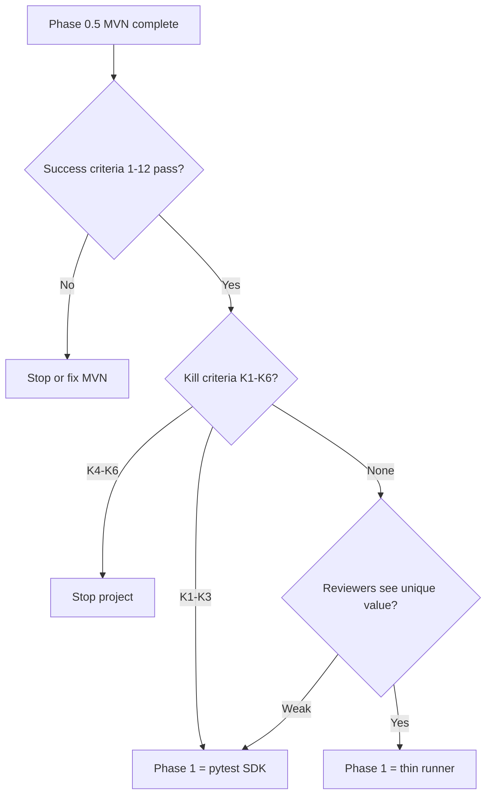

# Phase 0.5: Minimal Viable Velaris (MVN)

| Field | Value |
|-------|-------|
| Status | Approved for design review |
| Created | 2026-06-02 |
| Precedes | Phase 1 (revised) |
| Follows | Phase 0 (RFCs + stress test) |
| Recommendation | B — revise before full runner |

## Purpose

Phase 0.5 exists to **prove or disprove the capability thesis in code** before investing in a full test runner, plugin SDK, or IR platform.

**Single question MVN must answer:**

> Can the same Python integration test run unchanged with `httpx` or `requests` selected only via config, with correct setup/teardown and actionable errors when binding is wrong?

Everything else is deferred.

---

## Exact scope

### In scope

| Area | Scope |
|------|-------|
| **CLI** | `velaris run [paths...]` with optional `--config`, `--capability api=<provider>` |
| **Config** | Minimal `velaris.toml`: `[capabilities.api]` provider + options |
| **Discovery** | Find `test_*.py` files; collect functions named `test_*` via `importlib` + `inspect` |
| **Capability** | One capability ID: `api` (inline `api@0.1` contract in `contract.py`) |
| **Providers** | Two hardcoded providers: `httpx`, `requests` |
| **Scope** | `test` scope only — new client instance per test, teardown after each test |
| **Injection** | Tests declare `api` as a function parameter; no other injectable params |
| **Execution** | Sequential run; assert failures captured; uncaught exceptions = test error |
| **Reporting** | stdout only: per-test pass/fail, summary line, traceback on failure |
| **Errors** | Missing provider, unknown provider, ambiguous provider (N/A with two explicit names), setup/teardown failure |

### Out of scope

| Excluded | Rationale |
|----------|-----------|
| Full Velaris runner (hooks, plugins, scheduling) | Proves capability model first |
| Plugin architecture (entry points, `VelarisPlugin`) | Hardcode two providers |
| TestSpec IR (JSON, dataclass pipeline, validators) | Use plain `(callable, signature)` tuples internally |
| Reporting beyond stdout | No JUnit, JSON, HTML, steps, attachments |
| Multiple capabilities | One capability only |
| Scopes beyond `test` | No session/module/step |
| `@velaris.parametrize`, tags, markers | Defer parameter binding complexity |
| Non-`api` function parameters | Tests with extra params are collection errors |
| Separate `velaris-contract-api` package | Inline Protocol in `contract.py` |
| `network` capability / dependency graph | No `requires`; flat single-node resolution |
| AST-based collection | `importlib` + `inspect.signature` |
| Parallel execution | Sequential only |
| pytest integration / coexistence | Evaluate after MVN gate |
| YAML/BDD authoring | Phase 6+ |
| Profiles (`--profile ci`) | Single config file + CLI override |
| Auth beyond bearer token from env | Minimal; document as best-effort |
| File upload, WebSocket, async | api@0.1 non-goals |

### api@0.1 subset for MVN

MVN implements a ** tightened subset** of [api@0.1](contracts/api-0.1.md):

| Contract element | MVN behavior |
|------------------|--------------|
| `ApiClient.get/post/put/patch/delete` | Implemented; explicit kwargs only: `headers`, `json`, `data`, `params` |
| `Response.status_code`, `.headers`, `.body`, `.text`, `.json()` | Implemented |
| `Response.raise_for_status()` | **Added for MVN** — not in original api@0.1 doc; required to avoid leaky assert patterns |
| `**kwargs` passthrough | **Forbidden** — raises `TypeError` on unknown kwargs to protect swap semantics |
| Redirect following | Default library behavior; not configurable in MVN |
| Cookie jars | Session-scoped within one test client; not shared across tests |
| Auth | Bearer via `auth = { type = "bearer", token_env = "VAR" }` only |

---

## Success criteria

All must pass before Phase 1 gate opens.

### Functional

1. **Provider swap** — One shared test file (≥3 tests, ≥30 lines total) passes with `provider = "httpx"` and `provider = "requests"` without code changes.
2. **Config binding** — Provider selected from `velaris.toml`; CLI `--capability api=requests` overrides config.
3. **Options honored** — `base_url`, `timeout`, `verify_ssl`, `default_headers` affect both providers identically from the test's perspective.
4. **Teardown** — Connections closed after each test (verified by provider unit tests using mock transport or `closed` state assertion).
5. **Injection** — Only parameter named `api` is injected; tests without `api` param run as plain functions; tests with unknown params fail at collection with clear message.
6. **Failure reporting** — Failed assertion prints test name, file path, and traceback to stdout; exit code 1.

### Error handling

7. **Missing provider** — Config references `provider = "curl"` → error before any test runs, lists available: `httpx`, `requests`.
8. **No provider configured** — When both providers exist and config omits `provider` → error (no silent default; forces explicit binding).
9. **Setup failure** — Invalid `base_url` or client init failure → test marked error, teardown still attempted.

### Engineering

10. **LOC budget** — Production code under `src/velaris/` ≤ 1000 LOC (excluding tests, comments, blank lines).
11. **CI runnable** — `pip install -e . && velaris run tests/` works in GitHub Actions in ≤15 lines of workflow YAML.
12. **Dogfood tests** — ≥15 tests testing discovery, injection, resolver, both providers (using `httpx` mock transport or `httpbin`-free local stub).

### Validation (human)

13. **Kill question answered** — Document written answer to "What did MVN demonstrate that pytest fixtures cannot?" based on running demo, not theory.
14. **External feedback** — ≥2 reviewers (design partners or peers) watch swap demo or review repo; feedback captured in `docs/design-partners/feedback/`.

---

## Kill criteria

Stop or pivot if any trigger fires after MVN is complete.

### Pivot to pytest capability SDK (Mode C)

| Trigger | Signal |
|---------|--------|
| K1 | ≥2 reviewers say "I would only use this as a pytest plugin" |
| K2 | Swap demo feels identical to `os.environ["PROVIDER"]` + shared pytest fixture |
| K3 | Zero interest in `velaris run` as CLI entry point |

**Action:** Phase 1 becomes `velaris-pytest` + extracted `velaris-contract-api` package; abandon standalone runner.

### Stop project

| Trigger | Signal |
|---------|--------|
| K4 | Cannot implement both providers within LOC budget without violating swap semantics (kwargs leak, divergent behavior on shared test suite) |
| K5 | Both providers pass unit tests but shared integration tests fail due to unbridgeable library differences |
| K6 | ≥2 reviewers say capability model adds no value over documented fixture naming conventions |

**Action:** Archive MVN; publish learnings; do not proceed to Phase 1.

### Continue to Phase 1 (revised)

Proceed only if:

- K1–K6 all **not** triggered
- Success criteria 1–12 all pass
- At least one reviewer identifies **ambiguity errors** or **config-native binding** as genuine pain solved (not just "nice CLI")

---

## Architecture decisions retained

These ideas from the RFCs survive in MVN in simplified form.

| Decision | MVN form |
|----------|----------|
| Capability ID as injection name | Parameter must be named `api` |
| Config-driven provider binding | `velaris.toml` + CLI override |
| Provider implements contract Protocol | `HttpxApiClient` / `RequestsApiClient` implement `ApiClient` |
| Factory + teardown | `(client, teardown_fn)` per test |
| Fail fast on bad binding | Error at session start / first test |
| Core knows no HTTP library | HTTP logic only in `providers/` |
| Contract version concept | `CONTRACT_VERSION = "0.1"` constant; config may pin; not enforced beyond single contract |
| Explicit provider registration | Hardcoded dict in `registry.py` (concept retained, not plugin API) |
| Response abstraction | Wrapper types; tests never see httpx/requests response objects |

---

## Architecture decisions deferred

| Decision | Deferred to | Notes |
|----------|-------------|-------|
| TestSpec IR (JSON schema) | Phase 1+ | Internal `CollectedTest` namedtuple/dataclass only |
| Plugin entry points (`velaris.plugins`) | Phase 2 | Hardcoded registry |
| Multiple capabilities + DAG resolver | Phase 2 | Single capability, no `requires` |
| Session/module/step scopes | Phase 2 | Test scope only |
| Capability profiles | Phase 2 | CLI + single config |
| `@velaris.parametrize` | Phase 1+ | Reject non-`api` params in MVN |
| Protocol detection via import path | Phase 1+ | Name-based detection only: param == `api` |
| Separate `velaris-contract-api` package | Phase 1+ | Extract after MVN validates interface |
| Lifecycle hooks / event bus | Phase 1+ | |
| Reporting (JUnit, JSON, steps) | Phase 4 | |
| Parallel workers | Phase 5 | |
| YAML/BDD → IR | Phase 6 | |
| pytest coexistence (Mode A/B/C) | Phase 1 gate decision | |
| `network` capability | Phase 2+ | Removed from MVN |
| Ambiguity error with priority | Phase 2 | MVN has exactly two providers; ambiguity = unset config |
| Compliance test suite package | Phase 2 | MVN has inline provider tests |
| Auth beyond bearer | Phase 2 | |
| Contract semver deprecation policy | Phase 7 | |

### Contradiction resolutions applied in MVN

| ID | Resolution |
|----|------------|
| C1 Contract version authority | Config `provider` wins; single contract version `0.1` only |
| C2 Detection paths | Single path: parameter name `api` |
| C4 Non-capability params | Rejected at collection — no parametrize in MVN |
| C7 Mode C status | MVN is runner-only spike; Mode C evaluated at Phase 1 gate |

---

## Package structure

```
velaris/
├── pyproject.toml
├── README.md
├── velaris.toml                    # example config (committed)
├── src/
│   └── velaris/
│       ├── __init__.py
│       ├── __main__.py
│       ├── py.typed
│       ├── cli.py
│       ├── config.py
│       ├── contract.py
│       ├── discovery.py
│       ├── injection.py
│       ├── runner.py
│       ├── reporting.py
│       ├── errors.py
│       ├── types.py
│       └── capabilities/
│           ├── __init__.py
│           ├── registry.py
│           ├── resolver.py
│           └── providers/
│               ├── __init__.py
│               ├── httpx.py
│               └── requests.py
└── tests/
    ├── conftest.py               # shared fixtures (mock server, config helpers)
    ├── unit/
    │   ├── test_config.py
    │   ├── test_discovery.py
    │   ├── test_injection.py
    │   ├── test_registry.py
    │   ├── test_resolver.py
    │   └── test_reporting.py
    ├── providers/
    │   ├── test_httpx_provider.py
    │   └── test_requests_provider.py
    └── integration/
        ├── test_swap_demo.py     # shared file run under both providers
        └── test_mvn_runner.py    # end-to-end CLI tests
```

**Dependencies (runtime):** `httpx`, `requests`, `tomli` (stdlib `tomllib` on 3.11+ with fallback)

**Dependencies (dev):** `pytest` (for MVN's own test suite only — not Velaris runtime)

---

## Public APIs

Stable for MVN review; may change before Phase 1.

### CLI

```bash
velaris run [paths...] [--config PATH] [--capability api=PROVIDER]
```

| Argument | Description |
|----------|-------------|
| `paths` | Files or directories (default: `tests/`) |
| `--config` | Path to `velaris.toml` (default: `./velaris.toml`) |
| `--capability api=PROVIDER` | Override provider: `httpx` or `requests` |

Exit codes: `0` all passed, `1` failures/errors, `2` config/collection error.

### Python (test author)

Tests are plain Python functions — no Velaris imports required at runtime:

```python
from velaris.contract import ApiClient  # typing only; optional for MVN

def test_list_users(api: ApiClient) -> None:
    response = api.get("/users")
    response.raise_for_status()
    assert len(response.json()) > 0
```

Optional: authors may omit type hint; injection is name-based.

### Python (downstream / Phase 1)

```python
from velaris.runner import run
from velaris.config import load_config

result = run(paths=["tests/integration"], config=load_config("velaris.toml"))
# result.exit_code: int
# result.passed, result.failed, result.errors: int
```

Exposed in `velaris.__init__` for programmatic invocation and CI embedding.

### Config file (`velaris.toml`)

```toml
[capabilities.api]
provider = "httpx"  # required: "httpx" | "requests"

[capabilities.api.options]
base_url = "https://httpbin.org"
timeout = 30.0
verify_ssl = true
default_headers = { Accept = "application/json" }

# optional bearer auth
[capabilities.api.options.auth]
type = "bearer"
token_env = "API_TOKEN"
```

---

## Internal APIs

Unstable; not documented for external use.

### `types.py`

```python
@dataclass(frozen=True)
class CollectedTest:
    name: str
    module: str
    filepath: Path
    lineno: int
    callable: Callable[..., Any]
    needs_api: bool

@dataclass
class RunResult:
    passed: int
    failed: int
    errors: int
    exit_code: int
```

No JSON serialization. No IR version field.

### `discovery.collect(paths: list[Path]) -> list[CollectedTest]`

- Expands directories to `test_*.py`
- Imports each module relative to cwd (see implementation notes)
- Returns callables + whether `api` in signature params

### `injection.build_kwargs(test: CollectedTest, capabilities: dict[str, Any]) -> dict`

- Returns `{"api": capabilities["api"]}` or `{}`
- Raises `InjectionError` if test has params other than `api`

### `capabilities.registry.get_provider(name: str) -> ProviderFactory`

- Raises `UnknownProviderError` / `ProviderNotConfiguredError`

### `capabilities.registry.list_providers() -> list[str]`

- Returns `["httpx", "requests"]`

### `capabilities.resolver.Resolver`

```python
class Resolver:
    def setup_api(self, factory, options: dict) -> Any: ...
    def teardown_api(self) -> None: ...
```

One method pair for MVN; generalizes to `setup/teardown(capability_id)` in Phase 2.

### `capabilities.providers.*.create_api_client(options: dict) -> tuple[ApiClient, Callable[[], None]]`

Provider module internal factory.

### `contract.py`

```python
CAPABILITY_ID = "api"
CONTRACT_VERSION = "0.1"

class Response(Protocol): ...
class ApiClient(Protocol): ...
```

---

## Module responsibilities

| Module | Responsibility | Est. LOC |
|--------|----------------|----------|
| `errors.py` | Exception hierarchy: `VelarisError`, `ConfigError`, `ProviderNotConfiguredError`, `UnknownProviderError`, `InjectionError`, `CollectionError` | 40 |
| `types.py` | `CollectedTest`, `RunResult`, `ProviderFactory` type alias | 35 |
| `contract.py` | `ApiClient`, `Response` Protocols; `CAPABILITY_ID`, `CONTRACT_VERSION` | 55 |
| `config.py` | Load/validate TOML; merge CLI `--capability` override; expose `api_provider`, `api_options` | 80 |
| `discovery.py` | Glob; import modules; find `test_*`; inspect signature for `api` param | 100 |
| `injection.py` | Validate params; build kwargs dict | 45 |
| `registry.py` | Hardcoded provider map; lookup; list available | 45 |
| `resolver.py` | Per-test setup/teardown for `api` | 65 |
| `providers/httpx.py` | `HttpxApiClient`, `HttpxResponse`, URL join, explicit kwargs, bearer auth | 100 |
| `providers/requests.py` | `RequestsApiClient`, `RequestsResponse`, session wrapper, bearer auth | 110 |
| `runner.py` | Session loop: collect → for each test: setup → inject → call → teardown → record | 90 |
| `reporting.py` | Print progress, failures, summary | 50 |
| `cli.py` | argparse; invoke `runner.run`; map exit code | 55 |
| `__init__.py`, `__main__.py` | Public exports; `python -m velaris` | 20 |
| **Total** | | **~875** |

LOC buffer: ~125 lines for edge cases without exceeding 1000.

---

## Development order

Build in this sequence; each step is demoable before the next.

### Step 1: Skeleton + contract (Day 1)

- `pyproject.toml`, package layout, `contract.py`, `errors.py`, `types.py`
- **Verify:** import `velaris.contract`; mypy/pyright clean on Protocols

### Step 2: Config (Day 1)

- `config.py` + example `velaris.toml`
- Unit tests: valid config, missing provider, invalid provider, CLI override
- **Verify:** load config returns provider + options dict

### Step 3: Providers (Days 2–3)

- `providers/httpx.py` then `providers/requests.py`
- Shared URL join helper (put in `providers/__init__.py` or `providers/_url.py` ~20 LOC)
- Provider unit tests against `httpx.MockTransport` / `requests` mock adapter
- **Verify:** both providers pass same compliance test list (5+ assertions)

### Step 4: Registry + resolver (Day 3)

- `registry.py`, `resolver.py`
- Unit tests: lookup, teardown called, setup failure handling
- **Verify:** resolver returns client, teardown closes it

### Step 5: Discovery + injection (Day 4)

- `discovery.py`, `injection.py`
- Unit tests: find tests, reject extra params, detect `api` param
- **Verify:** collect from sample `tests/fixtures/sample_tests/`

### Step 6: Runner + reporting (Day 4–5)

- `runner.py`, `reporting.py`
- Wire collect → resolve → inject → execute → teardown
- **Verify:** run sample tests end-to-end without CLI

### Step 7: CLI (Day 5)

- `cli.py`, `__main__.py`
- Integration test: subprocess `velaris run`
- **Verify:** exit codes 0/1/2

### Step 8: Swap demo + dogfood (Day 6)

- `tests/integration/test_swap_demo.py` — shared suite
- CI workflow
- Run full suite under both providers
- Write kill-question answer doc
- **Verify:** success criteria 1–12

### Step 9: Gate review (Day 7)

- External demo / async feedback
- Decide: Phase 1 runner vs pytest SDK vs stop
- **Verify:** success criteria 13–14

---

## Test strategy

### Layer 1: Provider unit tests (`tests/providers/`)

Test adapters in isolation — no Velaris runner.

| Test | httpx | requests |
|------|-------|----------|
| GET relative path + base_url | ✓ | ✓ |
| POST with json body | ✓ | ✓ |
| Response.json(), .text, .body | ✓ | ✓ |
| raise_for_status() on 4xx | ✓ | ✓ |
| default_headers sent | ✓ | ✓ |
| verify_ssl=false (mock) | ✓ | ✓ |
| unknown kwarg → TypeError | ✓ | ✓ |
| teardown closes client | ✓ | ✓ |

Use `httpx.MockTransport` for httpx; `responses` library or custom `requests` adapter mock for requests (dev dependency `responses` acceptable for MVN tests only).

### Layer 2: Component unit tests (`tests/unit/`)

| Module | Key cases |
|--------|-----------|
| `config` | valid, missing provider, bad provider, CLI override, default_headers parse |
| `discovery` | find tests, skip non-test functions, multiple files, empty dir |
| `injection` | api-only, reject `(api, foo)`, accept no-param tests |
| `registry` | get httpx/requests, unknown provider |
| `resolver` | setup/teardown, teardown on test failure |
| `reporting` | format pass/fail output (snapshot or substring match) |

### Layer 3: Integration tests (`tests/integration/`)

| Test | Description |
|------|-------------|
| `test_swap_demo.py` | ≥3 tests hitting mock server; run via programmatic `run()` with each provider |
| `test_mvn_runner.py` | subprocess CLI; assert exit codes and output contains test names |
| `test_missing_provider.py` | bad config → exit code 2, message lists providers |
| `test_teardown_on_failure.py` | assert fails → teardown still runs (mock tracks close) |

### Layer 4: Manual gate artifacts

| Artifact | Location |
|----------|----------|
| Kill question answer | `docs/phase-0.5-kill-question.md` (created at Step 8) |
| Reviewer feedback | `docs/design-partners/feedback/<reviewer>.md` |

### What MVN tests do NOT cover

- Real network calls to external services (use mocks only)
- pytest coexistence
- Parallel execution
- Parametrization
- Multiple capabilities

---

## Example config and test (reference)

**`velaris.toml`**

```toml
[capabilities.api]
provider = "httpx"

[capabilities.api.options]
base_url = "https://example.test"
timeout = 10.0
verify_ssl = true
```

**`tests/integration/test_swap_demo.py`**

```python
from velaris.contract import ApiClient


def test_get_users(api: ApiClient) -> None:
    response = api.get("/users")
    response.raise_for_status()
    data = response.json()
    assert isinstance(data, list)


def test_create_user(api: ApiClient) -> None:
    response = api.post("/users", json={"name": "Ada"})
    assert response.status_code == 201


def test_not_found(api: ApiClient) -> None:
    response = api.get("/missing")
    assert response.status_code == 404
```

Run:

```bash
velaris run tests/integration/test_swap_demo.py
VELARIS_CAPABILITIES_API_PROVIDER=requests velaris run tests/integration/test_swap_demo.py
# or: velaris run --capability api=requests tests/integration/
```

---

## Phase 1 gate decision tree

After MVN completes:



---

## References

- [Architecture Stress Test](architecture-stress-test.md)
- [Roadmap](roadmap.md)
- [RFC-001: Capability Model](rfc/RFC-001-capability-model.md)
- [api@0.1 Contract](contracts/api-0.1.md)
- [Design Partner Outreach](design-partners/outreach-plan.md)
