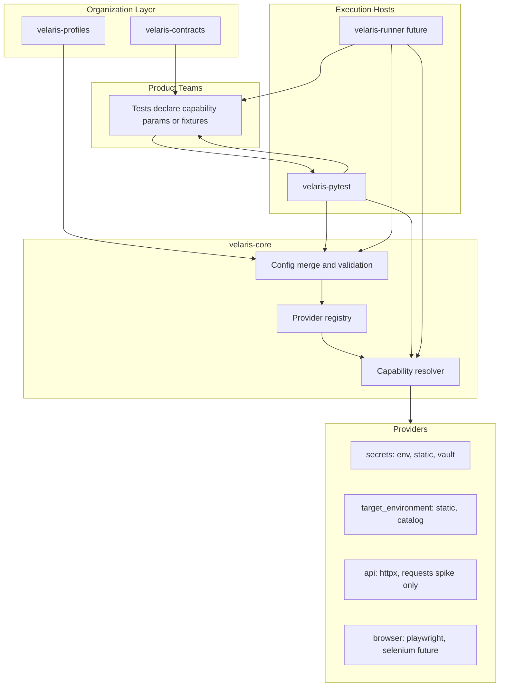
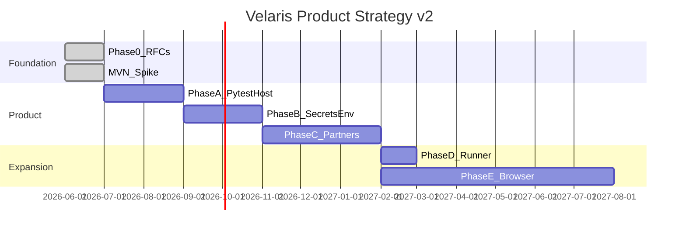

# Velaris Product Strategy v2

| Field | Value |
|-------|-------|
| Status | Approved |
| Created | 2026-06-02 |
| Supersedes | Standalone-runner-first product narrative (not RFC technical content) |
| Preserves | Phase 0.5 MVN as capability-resolution spike |

## Executive summary

**Velaris is a governance layer for test dependencies**, not a pytest replacement.

Platform teams publish **capability contracts**, org-wide **profiles**, and approved **providers**. Product teams write tests against capabilities (`secrets`, `target_environment`, later `browser`, `authentication`). **pytest remains the default execution host**; a standalone runner is optional for E2E-heavy repos later.

The current MVN codebase (Milestones 1–2) is retained as **`velaris-core` seed code** — config loading, contracts, errors, types — not as proof of product-market fit. Product validation shifts to **secrets + target_environment governance on pytest**.

---

## 1. Architecture after the governance-layer pivot

### Product definition

```text
Velaris = Capability Contracts + Profile Policy + Provider Registry + Resolution Engine
          hosted by pytest (default) or velaris-runner (optional)
```

Velaris does **not** own:
- Assertion semantics
- Test discovery for unit tests (pytest)
- Domain logic (HTTP, browsers, Vault — lives in providers)

Velaris **does** own:
- Versioned capability contracts (`secrets@0.1`, `target_environment@0.1`, …)
- Config-driven provider binding (`velaris.toml` + profiles)
- Session-start validation (required secrets, unknown providers, profile merge errors)
- Provider registry and resolution (setup/teardown, scopes)
- Org migration surface (profile flip, not 20-repo conftest edits)

### Logical architecture



### Execution model

| Layer | Responsibility |
|-------|----------------|
| **Contracts** | Stable Protocols, capability IDs, semver, compliance test specs |
| **Profiles** | Named policy bundles (`ci`, `local-hermetic`, `staging`) with `extends` |
| **Core** | Load config, merge profiles, validate bindings, resolve capabilities, teardown |
| **pytest host** | Map capabilities → pytest fixtures; session-start governance; run via `pytest` |
| **Runner host** | Map capabilities → direct injection; own discovery/CLI; for E2E repos without pytest |

### Relationship to RFCs

| RFC | Status under v2 |
|-----|-----------------|
| RFC-001 Capability Model | **Retained** — contracts, binding, resolver, scopes |
| RFC-002 TestSpec IR | **Deferred** — runner-host and YAML/BDD only (Phase D+) |
| RFC-006 pytest Coexistence | **Primary path** — pytest is default host, not coexistence exception |

### What the Platform Team Happy Path requires

Governance value does **not** require a new runner. It requires:

1. Published contracts across 20 teams
2. Org profiles managed by platform engineering
3. Fail-fast session validation (missing secrets, bad provider)
4. Visible config in code review (`velaris.toml` + profile extends)
5. Provider migrations via profile changes (Vault, Playwright, env catalog)

---

## 2. Package layout

Monorepo initially; packages split when adoption warrants publish boundaries.

```text
velaris/
├── packages/
│   ├── velaris-contracts/          # Published capability Protocols + constants
│   │   ├── velaris_contracts/
│   │   │   ├── secrets/v0_1.py
│   │   │   ├── target_environment/v0_1.py
│   │   │   ├── api/v0_1.py         # from MVN spike; not hero contract
│   │   │   └── authentication/     # Phase E prep
│   │   └── testing/                # Contract compliance harnesses
│   │
│   ├── velaris-profiles/             # Org profile templates + merge/extends logic
│   │   └── velaris_profiles/
│   │       ├── merge.py
│   │       ├── templates/
│   │       │   ├── ci.toml
│   │       │   ├── local-hermetic.toml
│   │       │   └── staging.toml
│   │       └── schema.py
│   │
│   ├── velaris-core/                 # Config, registry, resolver, errors (host-agnostic)
│   │   └── velaris_core/
│   │       ├── config.py           # from MVN config.py (extended)
│   │       ├── errors.py           # from MVN errors.py
│   │       ├── registry.py
│   │       ├── resolver.py
│   │       ├── types.py            # from MVN types.py (extended)
│   │       └── providers/          # reference provider implementations
│   │
│   ├── velaris-pytest/               # Primary adoption surface
│   │   └── velaris_pytest/
│   │       ├── plugin.py           # pytest11 entry point
│   │       ├── fixtures.py         # capability_fixture("secrets"), etc.
│   │       └── session.py          # session-start validation hook
│   │
│   └── velaris-runner/               # Optional future host (Phase D)
│       └── velaris_runner/
│           ├── cli.py
│           ├── discovery.py
│           ├── injection.py
│           ├── runner.py
│           └── reporting.py
│
├── docs/
├── velaris.toml                      # example project config
└── pyproject.toml                  # workspace root or meta-package
```

### Package responsibilities

| Package | Purpose | Consumers |
|---------|---------|-----------|
| **velaris-contracts** | Versioned Protocols; no runtime deps on httpx/Vault | All teams (typing); provider authors |
| **velaris-profiles** | Profile merge, `extends`, org template distribution | Platform team; CI templates |
| **velaris-core** | Config + registry + resolver; no pytest import | velaris-pytest, velaris-runner |
| **velaris-pytest** | pytest pluggy integration; **default host** | All product repos |
| **velaris-runner** | CLI + discovery + injection; **optional host** | E2E/integration repos |

### Dependency direction

```text
velaris-contracts  ←  (no internal velaris deps)

velaris-profiles   →  velaris-core (config types only)

velaris-core       →  velaris-contracts (metadata only, optional)

velaris-pytest     →  velaris-core, velaris-profiles, pytest

velaris-runner     →  velaris-core, velaris-profiles
```

---

## 3. Existing Milestone 1 and Milestone 2 code — retained

Current `src/velaris/` maps to **`velaris-core`** and **`velaris-contracts`** after refactor (no throwaway).

| Current module | Retained as | Notes |
|----------------|-------------|-------|
| `errors.py` | `velaris-core/errors.py` | Full hierarchy; extend for profile merge errors |
| `types.py` | `velaris-core/types.py` | `RunResult` runner-only later; `CollectedTest` runner-only; `ProviderFactory` stays in core |
| `contract.py` | `velaris-contracts/api/v0_1.py` | Extract from core; api remains spike contract, not flagship |
| `config.py` | `velaris-core/config.py` | **Primary retained asset** — merge, validate, CLI/env overrides |
| `__init__.py` | Split across packages | Public API per package |
| `py.typed` | Each published package | PEP 561 |
| `capabilities/` placeholders | `velaris-core/providers/` | Milestone 3 spike providers land here |
| `tests/unit/test_config.py` | `velaris-core/tests/` | Config tests remain core regression suite |
| `velaris.toml` (example) | docs + velaris-profiles templates | Evolves into profile examples |

### MVN spike completion (optional, low priority)

Remaining MVN milestones (providers, registry, resolver) **complete the resolution engine in velaris-core** and inform velaris-pytest fixture lifecycle. They are **engineering validation**, not Phase A product deliverables.

| MVN milestone | Disposition |
|---------------|-------------|
| M3 Providers (httpx/requests) | `velaris-core/providers/api/` — reference impl for resolver tests |
| M4 Registry + resolver | `velaris-core/registry.py`, `resolver.py` |
| M5 Discovery + injection | **`velaris-runner` only** (Phase D) |
| M6 Runner + reporting | **`velaris-runner` only** (Phase D) |
| M7 CLI | **`velaris-runner` only** (Phase D) |

---

## 4. Code that becomes runner-specific

Lives in **`velaris-runner`** only. Not required for Phase A adoption.

| Concern | Modules | Why runner-only |
|---------|---------|-----------------|
| CLI | `cli.py`, `__main__.py` | pytest is the CLI for default path |
| Discovery | `discovery.py` | pytest collects tests; runner reimplements for `velaris run` |
| Injection | `injection.py` | Runner calls test functions directly; pytest uses fixtures |
| Execution loop | `runner.py` | Replaces pytest session loop |
| Stdout reporting | `reporting.py` | pytest handles output; runner needed for standalone UX |
| `CollectedTest` IR | `types.py` (subset) | Internal to runner collection |
| `RunResult` aggregation | `types.py` (subset) | Runner exit codes |
| `parse_capability_override` CLI wiring | thin wrapper in `cli.py` | Core keeps parsing; runner exposes `--capability` |

**RFC-002 TestSpec IR** — runner-host concern (Phase D+). Not built for pytest host in Phase A.

---

## 5. Code that becomes pytest-host-specific

Lives in **`velaris-pytest`**. This is the **primary adoption surface**.

| Concern | Modules | Behavior |
|---------|---------|----------|
| pytest plugin entry | `plugin.py` | `pytest11` entry point; register hooks |
| Session-start governance | `session.py` | Load profile + config; validate all capability bindings; fail session before collection completes |
| Capability fixtures | `fixtures.py` | `@pytest.fixture` wrappers calling `velaris-core` resolver |
| `capability_fixture("secrets")` | public API | Product teams opt into governed capabilities |
| Profile activation | `plugin.py` | `--velaris-profile ci` or `VELARIS_PROFILE` |
| pytest marker integration | optional | `@pytest.mark.velaris_profile("ci")` |
| Parametrize coexistence | future | Governed capabilities + pytest parametrize for test data |

### pytest host does NOT own

- Contract definitions → `velaris-contracts`
- Profile templates → `velaris-profiles`
- Provider implementations → `velaris-core/providers` or separate plugin packages
- Config merge algorithm → `velaris-core/config.py`

### Developer experience (Phase A target)

```bash
pytest tests/integration/ --velaris-profile ci
```

```python
# conftest.py (platform template)
pytest_plugins = ["velaris_pytest.plugin"]

# test file
from velaris_contracts.secrets.v0_1 import Secrets

def test_payment_api(secrets: Secrets) -> None:
    token = secrets.get("PAYMENT_API_KEY")
    ...
```

---

## 6. Revised roadmap

Replaces post-MVN Phase 1a/1b branching. **Phase 0 (RFCs) and Phase 0.5 (MVN spike) remain complete/in progress as engineering foundation.**

### Phase A: Contracts + Profiles + Pytest Host

**Goal:** Ship minimum governance product (MGP). pytest is the only execution host.

| Deliverable | Package |
|-------------|---------|
| Extract `secrets@0.1`, `target_environment@0.1` contracts | velaris-contracts |
| Profile merge + `extends` + org templates (`ci`, `local-hermetic`) | velaris-profiles |
| Extend config for multi-capability + profile overlay | velaris-core |
| Registry + resolver (test scope; secrets + target_environment) | velaris-core |
| Reference providers: secrets (`env`, `static`); target_environment (`static-urls`) | velaris-core |
| pytest plugin: session validation + capability fixtures | velaris-pytest |
| Migration guide: RFC-006 Stage 1 → Mode C | docs |

**Explicitly not in Phase A:** standalone runner, browser, authentication providers, api swap demo as hero story, TestSpec IR JSON.

**Exit criteria:**
- Platform template: profile + pytest plugin works in 2 internal example repos
- Session fails at start when required secret missing (not mid-test)
- Profile switch changes secrets provider without test code change
- Config + profile visible in code review

**Complexity:** Medium (6–8 weeks)

---

### Phase B: Secrets and Target Environment capabilities (production-grade)

**Goal:** Full governance story for Platform Team Happy Path migrations (env → Vault, static URLs → env catalog).

| Deliverable | Package |
|-------------|---------|
| `secrets` provider: `vault` (or mock vault for OSS) | velaris-core or velaris-plugin-vault |
| `target_environment` provider: `env-catalog` (internal URL resolver) | velaris-core |
| Required-key schema validation at session start | velaris-core + velaris-pytest |
| Profile migration docs: `.env` → Vault via profile flip | docs |
| Contract compliance test suites | velaris-contracts/testing |
| Optional: finish MVN api providers as resolver regression tests | velaris-core |

**Exit criteria:**
- Documented migration: local profile (`env` secrets) → ci profile (`vault`) — zero test edits
- `target_environment` binds base URLs consumed by other capabilities (composition)
- Compliance tests pass for all reference providers

**Complexity:** Medium–High (6–8 weeks)

---

### Phase C: Design partner validation

**Goal:** External proof of governance value — not resolver mechanics.

| Deliverable | Activity |
|-------------|----------|
| 2–3 design partner orgs onboard | outreach plan |
| Partner uses velaris-pytest + profiles in CI | required |
| Feedback on secrets/target_environment governance | captured in design-partners/feedback/ |
| Kill/pivot review | governance vs pytest plugin |

**Exit criteria:**
- ≥1 partner runs governed capabilities in CI for 4+ weeks
- ≥2 partners confirm: profile migration or required-secret validation solves real pain
- Documented answer: "Why not acme-pytest-plugin only?"

**Kill criteria (unchanged in spirit):**
- All partners say shared pytest package is sufficient → **stop or maintain contracts-only OSS**
- Zero CI adoption → pivot messaging or stop

**Complexity:** Ongoing (2–3 months calendar)

---

### Phase D: Optional standalone runner

**Goal:** `velaris run` for E2E repos that want side-by-side (RFC-006 Mode A) or future non-pytest workflows. **Not required for platform adoption.**

| Deliverable | Package |
|-------------|---------|
| Reuse velaris-core resolver unchanged | velaris-core |
| discovery, injection, runner, reporting, CLI | velaris-runner |
| `velaris run --profile ci` | velaris-runner |
| Shared config/profiles with pytest host | both hosts |

**Exit criteria:**
- Same `velaris.toml` + profile works under pytest and `velaris run`
- One E2E repo chooses runner by team preference; not mandated org-wide

**Complexity:** Medium (4–6 weeks) — mostly MVN milestones 5–7 repackaged

---

### Phase E: Browser ecosystem

**Goal:** Flagship capability for long-term plugin ecosystem (Platform Team Happy Path: Selenium → Playwright migration).

| Deliverable | Package |
|-------------|---------|
| `browser@1.0` contract RFC + Protocol | velaris-contracts |
| Providers: playwright, selenium (minimal contract surface) | velaris-plugin-* |
| pytest fixtures + profile bindings | velaris-pytest |
| Optional runner support for QA E2E repos | velaris-runner |
| Contract compliance suite | velaris-contracts/testing |

**Explicitly not in Phase E v1:** mobile-native, commercial grids (BrowserStack) — follow-on plugins.

**Exit criteria:**
- Same UI test, `browser.provider = playwright` vs `selenium` via profile — no test code change
- ≥1 design partner completes pilot migration via profile flip

**Complexity:** Very High (3–6 months)

---

### Roadmap visualization



---

## 7. MVN success criteria — re-evaluated under governance model

The original MVN criteria optimized for **resolver mechanics** and **standalone runner** proof. Under v2, criteria split into **spike** (engineering) vs **product** (governance).

### MVN spike criteria (capability-resolution engine)

These remain valid for **`velaris-core`** completion. They do **not** gate product launch.

| Original # | Criterion | v2 status |
|------------|-----------|-----------|
| 1 | Provider swap (httpx ↔ requests) | **Spike only** — resolver regression test |
| 2 | Config binding + CLI override | **Retained** — core config tests (done M2) |
| 3 | Options honored | **Spike** — api providers |
| 4 | Teardown | **Retained** — core resolver requirement |
| 5 | Injection (api param only) | **Runner-specific** — not Phase A gate |
| 6 | Stdout failure reporting | **Runner-specific** — pytest handles Phase A |
| 7–9 | Error handling (missing/unknown provider) | **Retained** — core config (partially done M2) |
| 10 | LOC ≤ 1000 for spike | **Scoped to velaris-core resolver slice**, not whole product |
| 11 | CI `velaris run` | **Replaced** — CI `pytest --velaris-profile ci` |
| 12 | ≥15 dogfood tests | **Split** — core unit tests + pytest plugin tests |
| 13 | Kill question (mechanics) | **Demoted** — appendix to spike report |
| 14 | External feedback on swap demo | **Replaced** — Phase C partner validation |

### Product success criteria (Phase A + C — governance model)

These replace MVN as **Phase 1 gate**.

| # | Criterion | Measures |
|---|-----------|----------|
| P1 | **Profile switch without test edits** | `local-hermetic` → `ci` changes secrets provider; tests unchanged |
| P2 | **Required secrets fail at session start** | Missing `PAYMENT_API_KEY` → pytest session error before test 1 |
| P3 | **Config visible in review** | Capability bindings live in `velaris.toml` + profile extends, not buried in conftest |
| P4 | **Contract vocabulary shared** | ≥2 capabilities (`secrets`, `target_environment`) used with published Protocols |
| P5 | **pytest-native workflow** | `pytest tests/integration/` with plugin; no second runner required |
| P6 | **Platform template shippable** | Org can publish `velaris-profiles` template consumed by product repos |
| P7 | **Migration story documented** | env secrets → Vault via profile flip (Platform Happy Path) |
| P8 | **Design partner validation** | ≥1 org runs P1–P3 in CI; ≥2 confirm governance pain solved |
| P9 | **Honest kill review** | Written comparison vs shared pytest plugin package |

### Revised kill criteria

| Trigger | Action |
|---------|--------|
| Partners say pytest plugin with conventions is enough | Contracts-only OSS or stop |
| Required-secret validation not valued | Deprioritize secrets; reassess target_environment |
| Profile merge too complex for teams | Simplify to single `velaris.toml` per repo (no extends) |
| Resolver spike fails (K4–K5 from MVN) | Fix core before any host ships |

### What MVN proved vs what Phase A must prove

| Question | MVN spike answer | Phase A must answer |
|----------|------------------|---------------------|
| Can config bind providers? | Yes (M2 done) | Yes, multi-capability + profiles |
| Can tests swap httpx/requests? | Engineering concern | **Irrelevant to product gate** |
| Why not pytest fixtures? | Weak for api swap | **Strong for secrets + profiles + session validation** |
| Will teams adopt `velaris run`? | Unlikely (K3) | **Not asked** — pytest is host |

---

## Strategic decisions (frozen)

| Decision | Choice |
|----------|--------|
| Product identity | Governance layer |
| Default execution host | pytest (`velaris-pytest`) |
| Standalone runner | Optional Phase D |
| Hero capabilities | secrets, target_environment (Phase A–B); browser (Phase E) |
| api@0.1 | Resolver spike only; not product narrative |
| RFC-002 IR | Deferred to runner / YAML future |
| MVN codebase | Retain as velaris-core seed; do not discard |
| docs/roadmap.md | Unchanged per pivot instruction; this doc is strategic north star |

---

## References

- [Phase 0.5 MVN Spec](phase-0.5-mvn.md) — spike specification (historical)
- [Architecture Stress Test](architecture-stress-test.md)
- [RFC-001 Capability Model](rfc/RFC-001-capability-model.md)
- [RFC-006 pytest Coexistence](rfc/RFC-006-pytest-coexistence.md)
- [Design Partner Outreach](design-partners/outreach-plan.md)
- [Roadmap](roadmap.md) — prior phased plan (not updated by this document)
