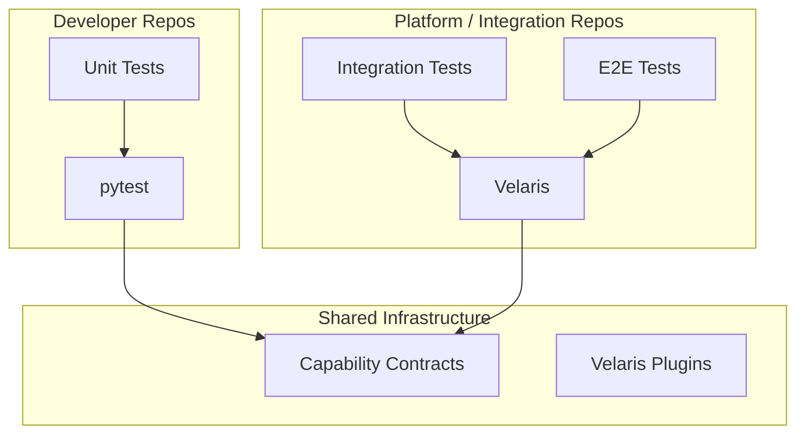

# RFC-006: pytest Coexistence and Migration Strategy

::: warning Archived — enterprise pivot
Historical platform-team migration strategy. **Not** the current hobby-framework direction. See [roadmap](/roadmap) and [archive README](../README.md).
:::

| Field | Value |
|-------|-------|
| Status | Draft |
| Created | 2026-06-02 |
| Authors | Velaris Core Team |
| Reviewers | TBD (platform engineers) |
| Audience | Platform engineering teams |

## Summary

This RFC defines how Velaris coexists with pytest rather than replacing it. Velaris targets **integration and E2E test orchestration** for platform teams. Unit tests remain on pytest indefinitely unless an organization explicitly chooses otherwise.

**Explicit non-goal (Phases 1–5):** Velaris is not a pytest replacement for unit testing.

## Motivation

Platform teams evaluating Velaris will ask:

1. "Do we rewrite 10,000 unit tests?"
2. "Can we migrate incrementally?"
3. "What happens to our existing pytest plugins, conftest.py, and CI?"
4. "Why not just build another internal pytest plugin?"

Without a coexistence strategy, adoption fails before Phase 2.

## Strategic positioning



| Concern | Owner | Tool |
|---------|-------|------|
| Fast unit tests, mocking, TDD | Application teams | pytest |
| Cross-service integration, API suites | Platform team | Velaris |
| Browser/mobile E2E with swappable drivers | Platform team | Velaris |
| Org-wide capability contracts | Platform team | Velaris contract packages |
| CI reporting (JUnit XML) | Both | pytest plugins / Velaris reporters |

## Coexistence modes

Velaris supports three coexistence modes. Organizations may use one or combine them during migration.

### Mode A: Side-by-side runners (recommended for Phase 1–3)

Same repository, different test directories, different CI jobs.

```
project/
├── tests/
│   ├── unit/           # pytest
│   └── integration/    # Velaris
├── conftest.py         # pytest only
├── velaris.toml          # Velaris config
└── pyproject.toml
```

CI:

```yaml
jobs:
  unit:
    run: pytest tests/unit
  integration:
    run: velaris run --profile ci tests/integration
```

**Advantages:** Zero interference; clearest ownership boundary.
**Disadvantages:** Two commands, two configs.

### Mode B: pytest orchestrates Velaris (Phase 2+)

A thin pytest plugin (`velaris-pytest`) wraps Velaris execution inside pytest session:

```python
# tests/integration/test_api.py
import pytest

@pytest.mark.velaris
def test_users(velaris):
    velaris.run_test("tests/integration/test_users.py::test_list_users")
```

Or collect Velaris tests as pytest items:

```python
# conftest.py (integration folder only)
pytest_plugins = ["velaris_pytest.plugin"]
```

Developers run `pytest tests/integration` — familiar entry point. Velaris executes capability resolution and plugins under the hood.

**Advantages:** Single CI entry point during migration; IDE pytest integration works.
**Disadvantages:** Coupling to pytest session lifecycle; debugging spans two frameworks.

### Mode C: Velaris capabilities in pytest fixtures (Phase 3+)

Platform team publishes capability providers usable from pytest:

```python
# acme_testing/conftest.py (shared internal package)
import pytest
from velaris_pytest import capability_fixture

api = capability_fixture("api")  # reads velaris.toml binding

def test_users(api):
    response = api.get("/users")
    assert response.status_code == 200
```

Tests stay as pytest. Capability binding comes from Velaris config. Platform team governs contracts without forcing `velaris run`.

**Advantages:** Lowest migration friction; pytest ecosystem preserved.
**Disadvantages:** Loses some Velaris features (unified IR, YAML authoring) unless full runner adopted later.

## Recommended migration path

### Stage 0: Status quo

- All tests run via pytest
- Domain logic in pytest fixtures and plugins
- Pain points: fixture sprawl, driver lock-in, inconsistent reporting

### Stage 1: Extract contracts (no runner change)

1. Publish `velaris-contract-api`, `velaris-contract-browser` as internal packages
2. Refactor existing fixtures to return Protocol-typed objects
3. Document standard fixture names aligned with capability IDs

**Effort:** Low. **Value:** Proves contracts before Velaris adoption.

### Stage 2: Introduce Velaris for new integration tests

1. Add `velaris.toml` with capability bindings
2. New integration tests written for Velaris (`velaris run`)
3. Existing tests unchanged on pytest
4. CI adds separate Velaris job

**Effort:** Medium. **Value:** Validates capability model on real tests.

### Stage 3: Migrate high-value integration suites

Selection criteria for migration candidates:

- Tests that swap implementations (Playwright ↔ Selenium, httpx ↔ requests)
- Tests owned by platform team, not product squads
- Tests with flaky fixture setup that would benefit from explicit resolver errors
- Tests needing unified step reporting across domains

**Do not migrate:**

- Pure unit tests with heavy mocking
- Tests tightly coupled to pytest-only plugins (e.g., `pytest-django` internals)
- Tests where migration cost exceeds 2× rewrite value

### Stage 4: Optional pytest unification

Choose Mode B or C based on team preference, or keep side-by-side permanently.

## Feature parity matrix

| Feature | pytest | Velaris | Coexistence approach |
|---------|--------|-------|----------------------|
| Unit test assertions | native | native | Keep pytest |
| Fixtures | native | capabilities | Mode C bridge |
| Parametrize | `@pytest.mark.parametrize` | `@velaris.parametrize` | Both during migration |
| Markers/tags | `@pytest.mark.*` | `@velaris.tag` | Map in adapter |
| Plugins | pluggy hooks | VelarisPlugin | Separate ecosystems |
| Parallel | pytest-xdist | Velaris workers (Phase 5) | Separate jobs initially |
| JUnit XML | pytest plugin | Velaris reporter | Both emit JUnit |
| conftest.py | hierarchical | velaris.toml + profiles | Mode A: separate |
| IDE discovery | excellent | Phase 1+: Python adapter | Mode B preserves pytest IDE |

## Configuration coexistence

### pyproject.toml (pytest unchanged)

```toml
[tool.pytest.ini_options]
testpaths = ["tests/unit"]
python_files = ["test_*.py"]
markers = [
    "integration: marks integration tests (deselect with '-m not integration')",
]
```

### velaris.toml (integration/E2E)

```toml
[discovery]
paths = ["tests/integration", "tests/e2e"]
patterns = ["test_*.py"]

[capabilities.api]
provider = "httpx"
[capabilities.api.options]
base_url = "https://staging.example.com"

[profiles.ci]
[profiles.ci.capabilities.browser]
provider = "playwright"
[profiles.ci.capabilities.browser.options]
headless = true
```

No shared config file required. Optional: `[tool.velaris]` section in `pyproject.toml` as alternative to `velaris.toml` (Phase 3).

## CI/CD integration

### Dual-job pipeline (recommended)

```yaml
name: Tests

on: [push, pull_request]

jobs:
  unit:
    runs-on: ubuntu-latest
    steps:
      - uses: actions/checkout@v4
      - run: pip install -e ".[test]"
      - run: pytest tests/unit --junitxml=reports/unit.xml
      - uses: actions/upload-artifact@v4
        with:
          name: unit-results
          path: reports/unit.xml

  integration:
    runs-on: ubuntu-latest
    steps:
      - uses: actions/checkout@v4
      - run: pip install -e ".[test,velaris]"
      - run: velaris run --profile ci --report junit:reports/integration.xml
      - uses: actions/upload-artifact@v4
        with:
          name: integration-results
          path: reports/integration.xml
```

### Unified dashboard

Both jobs emit JUnit XML. CI platform (GitHub, GitLab, Buildkite) merges results. Velaris HTML/JSON reports supplement but do not replace JUnit for CI gates.

## Migration tooling (Phase 3+)

| Tool | Purpose |
|------|---------|
| `velaris migrate audit` | Scan pytest suite; suggest migration candidates |
| `velaris migrate fixture-map` | Generate capability binding draft from conftest.py |
| `velaris compat check` | Verify contract types match fixture return types |
| `velaris-pytest` plugin | Mode B/C bridge |

### Audit heuristics

`velaris migrate audit` flags tests with:

- Fixtures named `*browser*`, `*driver*`, `*api*`, `*client*`, `*db*`
- Parametrized fixture implementations
- Markers `@pytest.mark.integration`, `@pytest.mark.e2e`
- Files under `tests/e2e/`, `tests/integration/`

Output:

```
Migration report:
  High value: 47 tests (capability swap potential)
  Medium value: 123 tests (platform-owned integration)
  Keep on pytest: 891 tests (unit, django internals)
  Estimated effort: 3-4 sprints for high value subset
```

## Addressing "why not internal pytest plugin?"

Platform teams should choose Velaris over an internal pytest plugin when:

| Criterion | Internal pytest plugin | Velaris |
|-----------|------------------------|-------|
| Swappable implementations via config only | Requires conftest layering | Native capability binding |
| Contract governance across repos | Manual enforcement | Published contract packages |
| Non-Python authoring (YAML/BDD) | Not feasible | Compiles to same IR |
| Explicit ambiguity errors | conftest shadowing silent | Fail fast at session start |
| Vendor/plugin interchange | Fork internal plugin | Install community plugin |

Platform teams should **stay on pytest** when:

- Team is small (<10 engineers), single repo, no driver swap needed
- Existing pytest investment works; pain is not fixture-related
- No mandate to unify QA and dev authoring styles

## Developer experience during migration

### Documentation requirements

1. **Decision tree:** "Should this test use pytest or Velaris?" (one-page)
2. **Migration cookbook:** Convert a pytest integration test to Velaris (with before/after)
3. **Capability catalog:** List of org capabilities, providers, and config examples
4. **FAQ:** conftest vs velaris.toml, running both locally, debugging capability errors

### Local development

```bash
# Daily unit work — unchanged
pytest tests/unit -x

# Integration work — Velaris
velaris run tests/integration/test_api.py -x

# Full pre-push
pytest tests/unit && velaris run --profile local tests/integration
```

## Risk mitigation

| Risk | Mitigation |
|------|------------|
| Developers confused by two runners | Clear directory split; lint rule enforcing `tests/unit` = pytest only |
| Duplicate test utilities | Shared `acme-testing` package with Protocol types, no runner deps |
| CI time increases | Run jobs in parallel; Velaris job only on integration path changes (Phase 4+) |
| pytest plugin incompatibility | Document unsupported plugins; do not claim drop-in replacement |
| Migration stall | Stage 1 (contracts only) delivers value without runner switch |

## Kill criteria / pivot triggers

Pivot to **"Velaris as pytest capability SDK"** (Mode C only) if:

- Phase 2 swap demo feels identical to `@pytest.fixture(params=...)`
- Zero teams adopt `velaris run` after 6 months
- Platform teams reject second runner but want contracts

Pivot is valid success — contract standard may be the product, not the runner.

## Non-goals (this RFC)

- Migrating unit tests to Velaris
- pytest pluggy hook compatibility layer in core
- Automatic code transformation (pytest → Velaris) in Phase 0–2

## Open questions

1. Should `velaris-pytest` be first-party or community?
   - **Proposal:** First-party in Phase 3; required for enterprise adoption.

2. Shared `conftest.py` fixtures calling Velaris capabilities — supported?
   - **Proposal:** Mode C only; document as advanced pattern.

## Exit criteria (RFC-006)

- [ ] Platform team reviewer confirms side-by-side model is acceptable
- [ ] Migration stages 0–3 documented in team onboarding
- [ ] CI dual-job template validated against one real project structure
- [ ] "Why not pytest plugin" answer accepted by design partners

## References

- [RFC-001: Capability Model](./RFC-001-capability-model.md)
- [RFC-002: TestSpec IR](./RFC-002-testspec-ir.md)
- [Design Partner Outreach](../design-partners/outreach-plan.md)
- pytest documentation: https://docs.pytest.org/
