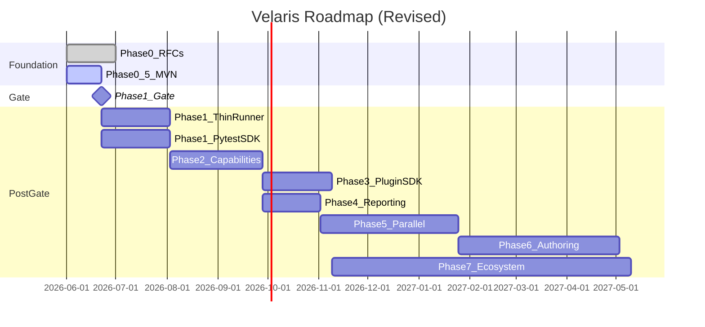

# Velaris Roadmap

| Field | Value |
|-------|-------|
| Status | Active |
| Updated | 2026-06-02 |
| Change | Phase 0.5 MVN inserted; Phases 1–7 revised per Recommendation B |

This roadmap reflects the architecture stress test outcome: **prove the capability model before building a full runner.**

---

## Overview

**Note:** Phase 1 has two branches (`1a` runner, `1b` pytest SDK). Only one proceeds after the Phase 1 gate. Phase 1b is the pivot path if kill criteria K1–K3 fire.

---

## Phase 0: Architecture and RFCs

**Status:** Complete (pending external review)

### Goals

De-risk the capability model on paper; align on IR and contract ownership.

### Deliverables

- [x] RFC-001: Capability Model
- [x] RFC-002: TestSpec IR
- [x] RFC-006: pytest Coexistence
- [x] api@0.1 contract pilot
- [x] Design partner outreach plan
- [x] Architecture stress test
- [ ] 2+ external RFC-001 reviewers (outreach in progress)

### Exit criteria

- Written answer to capabilities vs fixtures — see stress test
- IR examples for unit/API/UI — RFC-002
- pytest coexistence documented — RFC-006

### Complexity

Medium (2–4 weeks part-time) — **done**

---

## Phase 0.5: Minimal Viable Velaris (MVN)

**Status:** Active — design review

**Spec:** [phase-0.5-mvn.md](phase-0.5-mvn.md)

### Goals

Prove config-driven provider swap in ≤1000 LOC without building a full runner, plugin system, IR, or reporting platform.

### Deliverables

- Single-package MVN (`src/velaris/`)
- One capability: `api@0.1` (inline contract)
- Two providers: `httpx`, `requests`
- CLI: `velaris run` with stdout reporting
- Shared swap demo test suite
- CI workflow
- Kill question answer document
- ≥2 reviewer feedback artifacts

### Explicit non-goals

- Full Velaris runner
- Plugin entry points
- TestSpec IR serialization
- Reporting beyond stdout
- Parametrize, tags, profiles, parallel
- pytest integration

### Risks

| Risk | Mitigation |
|------|------------|
| Swap demo trivial vs pytest | Document honest kill-question answer |
| httpx/requests behavior diverges | Forbid kwargs passthrough; shared compliance tests |
| LOC budget exceeded | Hardcoded registry; no IR; reject extra params |
| Reviewers unavailable | Peer review acceptable; design partners preferred |

### Complexity

Small (1–2 weeks focused)

### Exit criteria

All success criteria in [phase-0.5-mvn.md](phase-0.5-mvn.md) § Success criteria (items 1–14).

### Kill criteria

See [phase-0.5-mvn.md](phase-0.5-mvn.md) § Kill criteria. Pivot or stop triggers Phase 1 gate decision.

---

## Phase 1 Gate

**Status:** Blocked on Phase 0.5

Decision tree after MVN:

| Outcome | Next phase |
|---------|------------|
| Success + reviewers want runner | Phase 1a: Thin runner |
| Success + reviewers want pytest only (K1–K3) | Phase 1b: pytest capability SDK |
| MVN fails swap semantics (K4–K5) | Stop or major contract revision |
| No unique value identified (K6) | Stop |

---

## Phase 1a: Thin Runner (if gate selects runner)

**Replaces:** Original Phase 1 (full runner)

### Goals

Minimal production runner extending MVN — not a pytest clone.

### Deliverables

- Extract `velaris-contract-api` to separate package
- In-memory `TestSpec` dataclass (no JSON export yet)
- Tags and `@velaris.skip` (no parametrize yet)
- Basic session lifecycle hooks (logging only, 3 hooks max)
- `velaris collect --dry-run` prints dataclass repr, not JSON
- Entry point plugin loading (optional: defer to Phase 2 if MVN gate is tight)
- 20+ dogfood tests

### Explicitly NOT in Phase 1a

- JSON IR schema
- JUnit/HTML reporting
- Parallel execution
- YAML/BDD
- Multiple capabilities (still api only, or add one trivial `clock` capability)

### Risks

Rebuilding pytest; scope creep from Phase 1 original spec

### Complexity

Medium (4–6 weeks)

### Exit criteria

- Run real project integration tests (smoke)
- Hook system extensible (one sample plugin adds CLI flag)
- CI runs Velaris on itself

---

## Phase 1b: pytest Capability SDK (if gate selects pivot)

**Alternative to Phase 1a**

### Goals

Deliver capability model value without a second runner.

### Deliverables

- `velaris-contract-api` published package
- `velaris-pytest` plugin with `capability_fixture("api")`
- Config reading from `velaris.toml` in pytest
- Provider registry usable from pytest fixtures
- Ambiguity detection at pytest session start
- Migration guide (RFC-006 Stage 1 → Mode C)

### Risks

pytest plugin ecosystem constraints; less control over reporting

### Complexity

Medium (4–6 weeks)

### Exit criteria

- Platform team uses `velaris-pytest` in CI for integration tests
- Provider swap via config demonstrated in pytest

---

## Phase 2: Capability System (revised)

**Depends on:** Phase 1a or 1b

### Goals

Generalize MVN resolver to multiple capabilities, scopes, and real plugin registration.

### Deliverables

- Capability registry with entry points
- Config binding for arbitrary capability IDs
- Scopes: `test`, `session`
- Second contract: `clock@1.0` (trivial) **or** expand `api@0.1` compliance suite
- Dependency graph without fake `network` stub (or real minimal `network`)
- `@velaris.parametrize` spec and implementation
- Documented comparison vs pytest fixture parametrization

### Risks

Over-generalizing resolver; contract bikeshedding

### Complexity

High (6–8 weeks)

### Exit criteria

- Same test file, swap providers via config for `api`
- Teardown verified under session scope
- Phase 2 kill criterion evaluated with honest doc

---

## Phase 3: Plugin SDK

### Goals

Third-party and platform-team plugin development.

### Deliverables

- `VelarisPlugin` SDK
- `velaris plugin init` scaffolding
- Contract authoring guide
- Plugin test harness
- Reference plugins: `velaris-plugin-httpx`, `velaris-plugin-requests` (extracted from MVN)
- Version compatibility matrix

### Complexity

Medium-High (4–6 weeks)

### Exit criteria

- External developer builds plugin in <1 day from docs

---

## Phase 4: Reporting

### Goals

Structured reporting for platform teams and CI.

### Deliverables

- Event bus (RFC-005)
- `velaris.step()` API
- Console tree, JSON, JUnit XML reporters
- Attachments interface

### Complexity

Medium (4–5 weeks)

### Exit criteria

- CI consumes JUnit XML
- UI plugin emits step tree without custom report code

---

## Phase 5: Parallel Execution

### Goals

Multi-worker execution with capability scope rules.

### Deliverables

- Process worker pool
- Worker-local session capabilities
- Event aggregation
- JSON IR serialization (if needed for worker IPC)

### Complexity

Very High (8–12 weeks)

### Exit criteria

- 4-worker run matches sequential results on integration suite

---

## Phase 6: Alternative Authoring Styles

### Goals

YAML/BDD compile to internal TestSpec; JSON IR export stable.

### Deliverables

- YAML compiler
- BDD/Gherkin compiler
- Shared step registry
- JSON Schema for TestSpec IR v1.0

### Complexity

Very High (10–14 weeks)

### Exit criteria

- Same `browser`/`api` capability from Python and YAML in one session

---

## Phase 7: Ecosystem Building

### Goals

Critical mass for platform adoption.

### Deliverables

- Official plugins (browser, database — pick 3–4)
- `velaris init` template
- Contract registry site
- Governance / semver policy exercised

### Complexity

Ongoing (6+ months)

### Exit criteria

- 1 non-founder org uses Velaris in CI
- 3+ community plugins
- One breaking contract change handled cleanly

---

## Phase comparison: original vs revised

| Original | Revised | Change |
|----------|---------|--------|
| Phase 1: full runner | Phase 0.5: MVN | Prove thesis first |
| Phase 2: capabilities | Phase 1 gate | Branch runner vs pytest SDK |
| — | Phase 1a/1b | Thin runner or SDK, not full runner |
| Phase 2 | Phase 2 | Generalize MVN; add scopes/plugins |
| Phases 3–7 | Phases 3–7 | Largely unchanged; IR JSON moves to Phase 5/6 |

---

## Current focus

**You are here:** Phase 0.5 design review → [phase-0.5-mvn.md](phase-0.5-mvn.md)

**Next action:** Review MVN spec → approve → implement Steps 1–9

**Do not start:** Phase 1a/1b until MVN exit criteria and gate decision complete.

---

## References

- [Phase 0.5 MVN Spec](phase-0.5-mvn.md)
- [Architecture Stress Test](architecture-stress-test.md)
- [RFC-001](rfc/RFC-001-capability-model.md)
- [RFC-006](rfc/RFC-006-pytest-coexistence.md)
