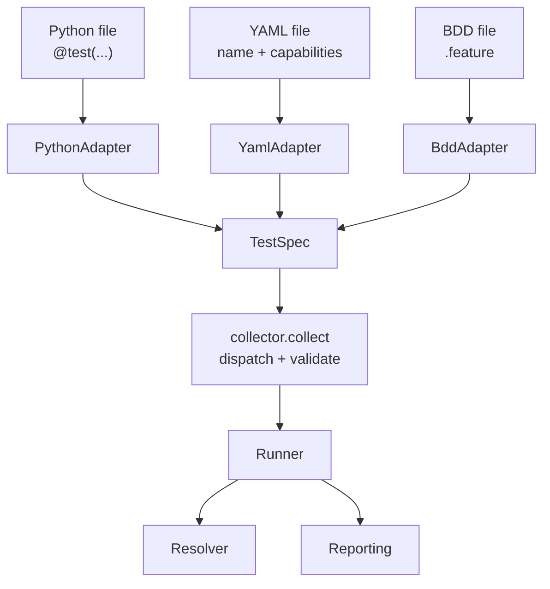

# Authoring Style Architecture (Milestone 9)

::: info Milestone report
Shipped in v0.1.0-alpha. Describes M9 design; for onboarding see [examples/authoring](/examples/authoring) and [getting started](/getting-started/first-test).
:::

| Field | Value |
|-------|-------|
| Milestone | 9 — Authoring Style Architecture |
| Date | 2026-06-02 |
| Goal | Multiple authoring styles → one execution engine |
| Constraint | Runner, resolver, reporting, and TestSpec unchanged |

**Question:** Can Velaris support multiple authoring styles without creating
multiple execution engines?

**Answer:** Yes. An authoring style is just a compiler to TestSpec. The runner
only consumes TestSpec, so adding a frontend never touches execution.

---

## 1. Adapter architecture diagram



The dispatcher (`collector.collect`) routes each file to the adapter that owns
its extension, then validates the combined TestSpec list. Everything below
TestSpec is identical for every authoring style.

---

## 2. Adapter interface

The smallest abstraction that supports multiple frontends — an adapter declares
the extensions it owns and compiles one file into TestSpec IR.

```python
@runtime_checkable
class AuthoringAdapter(Protocol):
    extensions: tuple[str, ...]

    def collect(self, path: Path) -> list[TestSpec]:
        ...
```

No registration system, no discovery, no priority rules. `default_adapters()`
returns the built-in list in deterministic order:

```python
def default_adapters() -> list[AuthoringAdapter]:
    return [PythonAdapter(), YamlAdapter()]
```

---

## 3. Python adapter

The original collection logic, unchanged in behavior, moved behind the adapter
interface:

```python
class PythonAdapter:
    extensions = (".py",)

    def collect(self, path: Path) -> list[TestSpec]:
        module = self._load_module(path)
        specs = []
        for name, obj in inspect.getmembers(module, inspect.isfunction):
            if not getattr(obj, "__velaris_test__", False):
                continue
            capabilities = list(getattr(obj, "__velaris_capabilities__", []))
            specs.append(TestSpec(name=name, capabilities=capabilities, callable=obj))
        return specs
```

Existing Python tests behave exactly as before.

---

## 4. Minimal YAML adapter

Declaration-only. Two keys: `name` and `capabilities`. No actions, steps,
keywords, or execution logic.

```python
class YamlAdapter:
    extensions = (".yaml", ".yml")

    def collect(self, path: Path) -> list[TestSpec]:
        raw = yaml.safe_load(path.read_text())
        # validate name + capabilities ...
        return [TestSpec(name=raw["name"], capabilities=raw["capabilities"])]
```

The resulting TestSpec uses the default **no-op body** (`noop_test`). The runner
resolves capabilities and runs the full lifecycle; only the body is empty.

To make this possible, `TestSpec.callable` gained a default:

```python
@dataclass(frozen=True)
class TestSpec:
    name: str
    capabilities: list[str]
    callable: Callable[..., Any] = field(default=noop_test)
```

This is the **only** change to the execution boundary. The runner code is byte
-for-byte unchanged.

---

## 5. Example YAML file

```yaml
name: test_random

capabilities:
  - random
```

---

## 6. TestSpec output example

```python
# From tests/test_random.yaml
TestSpec(
    name="test_random",
    capabilities=["random"],
    callable=noop_test,   # default declaration-only body
)

# From tests/test_dice.py
TestSpec(
    name="test_dice_roll",
    capabilities=["random"],
    callable=<function test_dice_roll>,
)
```

Both flow through `collector.collect → Runner → Resolver → Reporting`. Default
stdout from `examples/authoring`:

```text
✓ test_dice_roll
✓ test_login
✓ test_login_yaml
✓ test_random
✓ User logs in

Passed: 5
Failed: 0
Duration: 0.01s
```

Use `--debug` for the full trace (`RUN`, `RESOLVE`, capability observations).

---

## 7. Architectural risks discovered

1. **No-op body blurs "pass" semantics.** A YAML test passes by resolving its
   capabilities and doing nothing. Without assertions, "pass" means "setup
   succeeded," not "behavior verified." Future executable YAML must define what
   a meaningful assertion is.

2. **TestSpec gained a default to absorb body-less styles.** Convenient, but it
   means a malformed adapter can silently produce a no-op test that "passes."
   Validation checks structure (name, capabilities, callable) — not intent.

3. **Capability names are now declared in two grammars.** Python infers from
   parameter names; YAML lists strings. Drift is possible (a YAML typo only
   fails at resolution, like external plugins). No shared capability vocabulary.

4. **Directory dispatch couples ordering to adapter order.** Mixed directories
   collect all Python specs before YAML specs. Duplicate-name detection still
   works, but ordering is now adapter-defined rather than path-sorted.

5. **Each adapter owns its own parsing/error surface.** YAML errors,
   Python import errors, and (future) BDD parse errors raise `CollectionError`
   with different detail quality. No unified diagnostic format yet.

6. **The execution boundary must stay narrow.** The architecture holds only
   because TestSpec carries `name + capabilities + callable`. The moment an
   authoring style needs richer execution data (steps, parametrization,
   tables), TestSpec must grow — and that change touches every adapter and the
   runner. This is the real pressure point for future milestones.

---

## BDD adapter (Milestone 12)

Implemented as a minimal adapter — see [BDD Adapter](bdd-adapter.md). Given/When/Then lines are serialized capability calls that reuse the YAML action compiler. No keyword engine, no step matching.

---

## Verdict

Adding YAML required:

- 1 small change to TestSpec (default no-op body)
- 0 changes to runner, resolver, reporting

The execution engine is genuinely authoring-agnostic. Velaris can support
multiple authoring styles without multiple execution engines — as long as every
style compiles down to the same narrow TestSpec.
