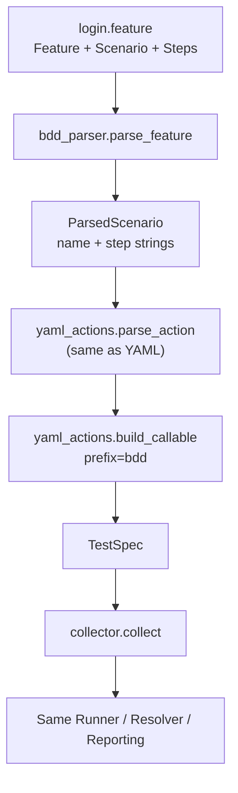

# Minimal BDD Adapter (Milestone 12)

::: info Milestone report
Shipped in v0.1.0-alpha. For hands-on use see [examples/authoring](/examples/authoring).
:::

| Field | Value |
|-------|-------|
| Milestone | 12 — Minimal BDD Adapter |
| Date | 2026-06-02 |
| Goal | Prove BDD compiles into the existing Velaris execution model |
| Constraint | No keyword engine; runner/resolver/reporting unchanged |

**Question:** Can BDD be implemented as "just another adapter" without introducing a second execution model?

**Answer:** Yes. Given/When/Then lines are serialized capability calls. The BddAdapter parses Gherkin structure, reuses the YAML action parser and callable generator, and produces ordinary `TestSpec` objects. The runner cannot tell BDD from Python or YAML.

---

## 1. BDD adapter architecture



Three authoring styles, one compiler backend for executable bodies:

| Style | Structure parser | Action compiler |
|-------|------------------|-----------------|
| Python | `PythonAdapter` | native function |
| YAML | `YamlAdapter` | `yaml_actions` |
| BDD | `BddAdapter` + `bdd_parser` | `yaml_actions` (reused) |

---

## 2. Minimal parser design

Line-based, no Gherkin library. Supported constructs only:

| Line | Purpose |
|------|---------|
| `Feature: …` | Feature title (metadata; one per file) |
| `Scenario: …` | Test name → `TestSpec.name` |
| `Given capability.method(...)` | Serialized capability call |
| `When capability.method(...)` | Serialized capability call |
| `Then capability.method(...)` | Serialized capability call |

Keywords carry **no semantics**. `Given browser.open("/login")` is identical to a YAML action or a Python statement. The parser strips the keyword and passes the remainder to `parse_action`.

Capabilities are **inferred** from step calls (unique capability names), unlike YAML which declares them explicitly.

Rejected at compile time: tags, tables, outlines, examples, background, `And`/`But`, doc strings, and any line that is not Feature/Scenario/step/comment.

---

## 3. Example feature file

`examples/authoring/tests/login.feature`:

```gherkin
Feature: Login

Scenario: User logs in

  Given browser.open("/login")
  When browser.type("#username", "demo")
  Then browser.click("#submit")
```

Run with the other authoring styles:

```bash
cd examples/authoring
velaris run tests/
```

---

## 4. Event parity demonstration

Python (`test_login.py`), YAML (`test_login.yaml`), and BDD (`login.feature`) emit **identical** browser `CapabilityObserved` events:

| Action | Data |
|--------|------|
| `open` | `{path: /login}` |
| `type` | `{path: #username, text: demo}` |
| `click` | `{path: #submit}` |
| `close` | `{}` (teardown) |

Verified by `test_python_yaml_and_bdd_emit_identical_browser_events` — only the test name differs in the JSON log.

---

## 5. TestSpec output example

```python
# From login.feature — scenario "User logs in"
TestSpec(
    name="User logs in",
    capabilities=["browser"],          # inferred from steps
    callable=<bdd::User logs in>,      # same closure shape as YAML
)
```

Equivalent YAML:

```yaml
name: User logs in
capabilities:
  - browser
actions:
  - browser.open("/login")
  - browser.type("#username", "demo")
  - browser.click("#submit")
```

Equivalent Python:

```python
@test("browser")
def test_login(browser):
    browser.open("/login")
    browser.type("#username", "demo")
    browser.click("#submit")
```

---

## 6. LOC impact

| Area | Lines | Note |
|------|-------|------|
| `adapters/bdd_parser.py` (new) | ~95 | Minimal Gherkin line parser |
| `adapters/bdd_adapter.py` (new) | ~45 | Compile scenarios → TestSpec |
| `adapters/yaml_actions.py` | ~+8 | Optional `declared`; `prefix` param |
| `adapters/base.py` | +2 | Register `BddAdapter` |
| `tests/test_bdd_adapter.py` (new) | ~130 | Parser, compile, event parity |
| `runner.py` / `resolver.py` / `reporting.py` | **0** | Unchanged |

~280 lines total; zero engine changes.

---

## 7. Architectural risks discovered

1. **Given/When/Then are syntactic sugar only.** They do not imply setup/action/assertion semantics. If users expect BDD behavior (steps matched by natural language, reusable step defs), they will be disappointed — and adding that would mean a keyword engine (the B line).

2. **Capabilities are inferred, not declared.** YAML requires an explicit list; BDD derives it from steps. A typo in a capability name only fails at resolution, same as YAML. No shared vocabulary across grammars.

3. **Scenario names become test names.** `"User logs in"` includes spaces — valid in Velaris but awkward for some reporters and filters. Sanitization would be a policy choice, not an engine concern.

4. **One compiler, three facades — until they diverge.** BDD and YAML share `yaml_actions`. The moment BDD needs step arguments from tables or scenario outlines, the shared compiler must grow — or BDD forks. That fork is the early warning sign for a second execution model.

5. **Not a Gherkin implementation.** Real `.feature` files use tags, backgrounds, and `And` continuations. Strict rejection keeps the adapter honest but limits drop-in compatibility.

6. **The hypothesis held.** BDD required no runner changes because executable BDD is just a ordered list of capability calls — same as YAML. The adapter boundary absorbed all Gherkin-specific structure.

---

## Verdict

BDD is **just another adapter**. No second execution model was introduced. The answer stayed "yes" because we refused everything that would make it "no": step matching, keyword registries, and natural-language parsing.

If Velaris ever ships real BDD, the line is clear: keep compiling to `TestSpec`, never compile to a parallel runtime.
