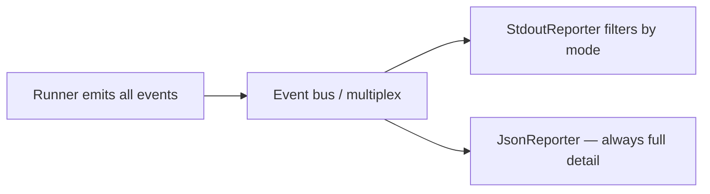

# CLI UX & Reporting Redesign (Milestone 11)

::: info Milestone report
Defines default ✓/✗ stdout (M11). See [CLI reference](/getting-started/cli) for current flags.
:::

| Field | Value |
|-------|-------|
| Milestone | 11 — CLI UX & Reporting Redesign |
| Date | 2026-06-02 |
| Goal | Default terminal output feels like a test framework, not a debug trace |
| Constraint | Event architecture preserved; runner/resolver behavior unchanged; JSON reporter unchanged |

**Question:** If a new user runs Velaris for the first time, does the output feel like a testing framework or a debug trace?

**Answer:** Yes — after this milestone. Default output shows pass/fail results and a summary. Framework internals are opt-in via `--verbose` and `--debug`.

---

## 1. Proposed CLI UX design

Three layers of terminal output, one event bus underneath:



| Mode | Flag | Audience | Shows |
|------|------|----------|-------|
| **Default** | _(none)_ | Everyday test runs | ✓/✗ per test + summary |
| **Verbose** | `--verbose` | Framework authors | Lifecycle: RUN, RESOLVE, PASS/FAIL, TEARDOWN |
| **Debug** | `--debug` | Deep debugging | Everything including capability observations |

Design principles applied:

- **Readability** — one line per test result in default mode
- **Signal over noise** — resolve/teardown/observations hidden by default
- **Test results first** — summary always visible; failures get dedicated formatting

---

## 2. Default / Verbose / Debug modes

See [sample output](../samples/cli-output-modes.txt) for captured terminal output.

### Default

```text
✓ test_insert_row
✓ test_read_seeded_row

Passed: 2
Failed: 0
Duration: 0.01s
```

### Verbose

```bash
velaris run tests/ --verbose
```

```text
RUN test_insert_row
RESOLVE database(memory)
PASS test_insert_row
TEARDOWN database
...
```

### Debug

```bash
velaris run tests/ --debug
```

Equivalent to pre-Milestone-11 behavior — full capability observation trace.

If both `--verbose` and `--debug` are passed, **debug wins**.

---

## 3. Failure output examples

Default mode formats failures for scanning:

```text
✗ test_login

AssertionError:
Expected 2 rows
Actual: 1

Passed: 0
Failed: 1
Duration: 0.00s
```

- ✗ marker and blank line separate the failing test from its error
- Exception type (`AssertionError`, `KeyError`, etc.) comes from the runner's existing catch blocks — surfaced via optional `TestFailed.error_type`
- Message body prints verbatim (supports multi-line assertion messages)

Verbose and debug modes retain the compact `FAIL test_name` + message format for parity with lifecycle output.

---

## 4. Event filtering strategy

Filtering lives entirely in `StdoutReporter`. The runner still emits every event; JSON log still records everything.

| Event | Default | Verbose | Debug |
|-------|---------|---------|-------|
| `TestStarted` | hidden | shown | shown |
| `CapabilityResolved` | hidden | shown | shown |
| `CapabilityObserved` | hidden | hidden | shown |
| `TestPassed` | `✓ name` | `PASS name` | `PASS name` |
| `TestFailed` | `✗ name` + formatted error | `FAIL name` + message | `FAIL name` + message |
| `CapabilityTeardown` | hidden | shown | shown |
| `RunFinished` | shown | shown | shown |

Implementation: `OutputMode` enum + mode check in each `StdoutReporter._on_*` handler. No changes to event types beyond adding optional `TestFailed.error_type` for failure formatting.

---

## 5. Sample output

Live capture from `examples/stress-test`:

**Default** — `velaris run tests/test_database.py`

```text
✓ test_insert_row
✓ test_read_seeded_row

Passed: 2
Failed: 0
Duration: 0.01s
```

**Browser example** — `cd examples/browser && velaris run tests/ --config velaris.fake.toml`

```text
✓ test_login

Passed: 1
Failed: 0
Duration: 0.00s
```

Full side-by-side samples: [docs/samples/cli-output-modes.txt](../samples/cli-output-modes.txt)

---

## 6. LOC impact

| Area | Lines | Note |
|------|-------|------|
| `output_mode.py` (new) | 12 | `OutputMode` enum |
| `stdout_reporter.py` | ~+40 net | Mode filtering + failure formatting |
| `cli.py` | +15 | `--verbose`, `--debug` flags |
| `events.py` | +1 | `TestFailed.error_type` optional field |
| `runner.py` | +12 | Wire `output_mode`; populate `error_type` on failure |
| `tests/test_cli_output.py` (new) | ~120 | Mode + CLI flag coverage |
| `json_reporter.py` | **0** | Unchanged — still logs all events |
| `resolver.py` | **0** | Unchanged |

Reporting-only redesign with minimal runner wiring (~180 lines total).

---

## 7. Risks discovered

1. **Unicode checkmarks (✓/✗) may not render on all terminals.** Acceptable for v0.1; ASCII fallback (`PASS`/`FAIL` prefixes) is a one-line change if needed.

2. **`TestFailed` gained `error_type`.** JSON logs now include this field when present. Backward compatible (optional, defaults to empty). Consumers parsing JSON should tolerate new fields.

3. **Debug mode is now explicit.** Tests and docs that relied on seeing `RESOLVE`/`database.insert_row` in default output must pass `--debug` or `output_mode=OutputMode.DEBUG` in the API.

4. **Two reporters, one truth.** Users who only watch stdout may miss capability observations. The intended escape hatch is `--json-log` (full detail always) or `--debug`.

5. **Failure formatting depends on exception messages.** Velaris does not parse tracebacks or diff assertion output. Rich failure UX (expected/actual blocks, syntax highlighting) would need a dedicated formatter — out of scope for this milestone.

6. **Mode is stdout-only.** Custom reporters passed via `run(reporters=[...])` receive all events regardless of mode. Only the built-in `StdoutReporter` filters.

---

## Verdict

Default output now reads like pytest or vitest at a glance: green checks, red crosses, a summary line. Framework internals remain available without changing the event architecture — `--verbose` for lifecycle, `--debug` for the full trace, `--json-log` for machine-readable everything.

A new user's first run feels like a **testing framework**. The debug trace is still there when you need it — it's just not the default anymore.
