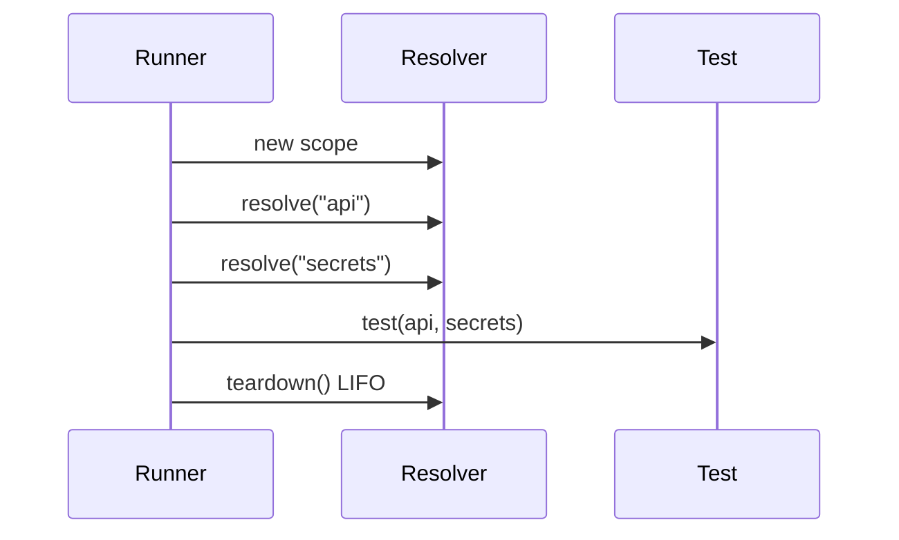

# Capabilities

A **capability** is a named dependency a test declares and receives by parameter injection.

## Declaration

Always use explicit capability lists in alpha:

```python
from velaris_core.decorators import test

@test("api", "secrets")
def test_checkout(api, secrets):
    ...
```

Rules:

- Parameter names **must match** capability IDs exactly
- Parameter order does not matter; capability list order defines resolution order
- Every parameter must appear in the capability list and vice versa

Bare `@test` (inferring from parameter names) works but explicit declaration is recommended.

## Contracts

Each capability has a **contract** — a `typing.Protocol` describing the interface:

```python
@runtime_checkable
class Secrets(Protocol):
    def get(self, name: str) -> str: ...
```

Built-in contracts live in `velaris-contracts`. External plugins define local Protocols.

Version convention: `secrets@0.1` means capability ID `secrets`, contract version `0.1`. Version is documentation-only in alpha — `@test("secrets")` does not enforce it.

## Built-in capabilities

| ID | Contract | Package |
|----|----------|---------|
| `api` | `ApiClient` | `velaris_contracts.api.v0_1` |
| `secrets` | `Secrets` | `velaris_contracts.secrets.v0_1` |
| `browser` | `Browser` | `velaris_contracts.browser.v0_1` |
| `target_environment` | `TargetEnvironment` | `velaris_contracts.target_environment.v0_1` |

## Resolution scope

Capabilities resolve **per test**, not per session:



Each test gets fresh instances (cached within the test scope). Teardown runs in reverse resolution order.

## External capabilities

Add capabilities outside `velaris-core` via the [Plugin Author Guide](/guide/plugin-author). Examples: `clock`, `database`, `filesystem`, `random`.
