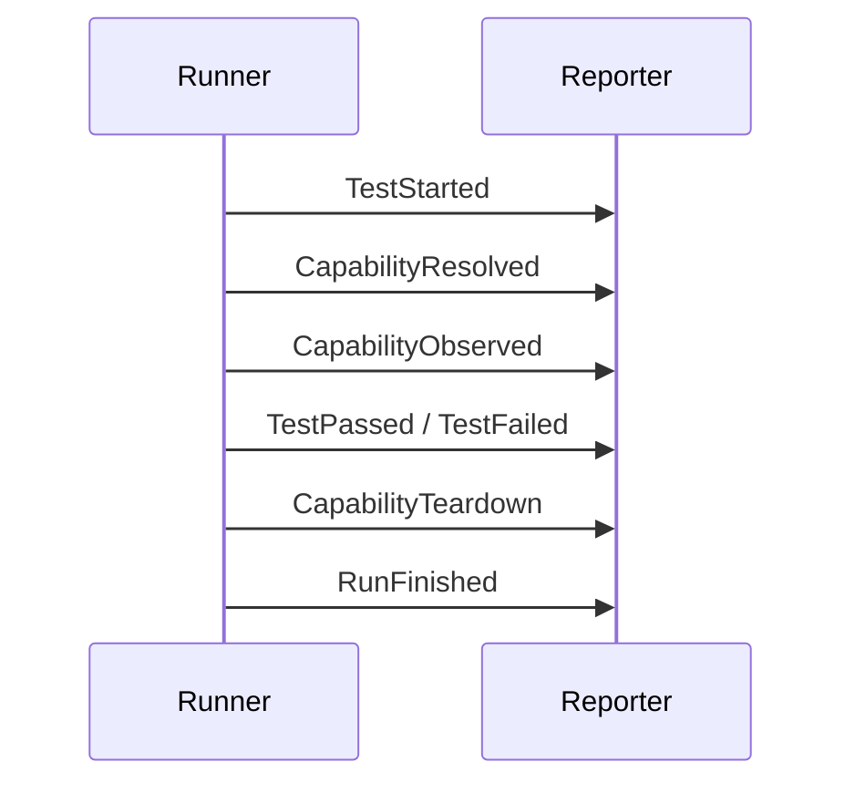

# Events & Reporting

Every test run produces a stream of **events**. Reporters consume events; tests and providers emit them.

## Event envelope

All events wrap in `EventEnvelope`:

```python
EventEnvelope(test="test_login", event=<inner event>)
```

Session-level events (e.g. `RunFinished`) use `test=None`. JSON logs include the `test` field for filtering.

## Lifecycle events



| Event | When |
|-------|------|
| `TestStarted` | Before resolution |
| `CapabilityResolved` | After factory returns instance |
| `CapabilityObserved` | Provider reports an action |
| `TestPassed` / `TestFailed` | After test callable returns or raises |
| `CapabilityTeardown` | After each teardown callable |
| `RunFinished` | End of run with pass/fail counts |

## CapabilityObserved

Structured provider observations:

```python
CapabilityObserved(
    capability="browser",
    action="open",
    data={"path": "/login"},
)
```

External capabilities use generic actions (`get_row`, `now`, `number`).

## Reporters

| Reporter | Output | When |
|----------|--------|------|
| `StdoutReporter` | Terminal (filtered by mode) | Always during `velaris run` |
| `JsonReporter` | JSON-lines file | `--json-log` or `--html-report` |
| HTML generator | Static `report.html` | `velaris report` or `--html-report` |

### Stdout modes

| Mode | Flag | Shows |
|------|------|-------|
| Default | _(none)_ | ✓/✗ per test + summary |
| Verbose | `--verbose` | RUN, RESOLVE, PASS/FAIL, TEARDOWN |
| Debug | `--debug` | Everything including capability observations |

See [CLI UX redesign](/cli-ux-redesign).

### JSON log

```bash
velaris run tests/ --json-log events.jsonl
```

Full event detail is always written to the JSON log, regardless of stdout mode.

### HTML report

```bash
# One command
velaris run tests/ --html-report

# Or from an existing log
velaris report events.jsonl -o report.html
```

See [HTML Report](/html-report).

## Debugging failures

1. Read default stdout — ✗ marker and error message
2. Use `--verbose` to see whether resolution succeeded before failure
3. Use `--debug` or `--json-log` for full capability observations
4. Generate `--html-report` for a browsable timeline
5. Check config binding if `ProviderNotConfiguredError`
6. Check cwd if external capability not registered

Test failures show exception type and message in default mode — no stack trace by default in alpha.

## Reporter protocol

Custom reporters implement `handle(event)`. Use `run(..., reporters=[...])` programmatically. The CLI wires stdout + optional JSON + optional HTML generation after the run.
