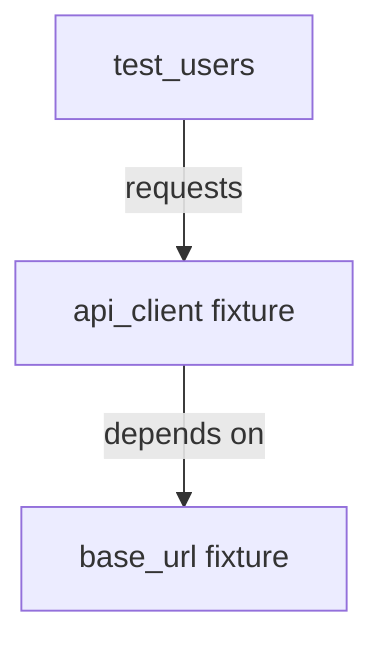
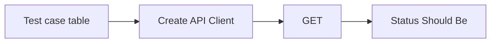
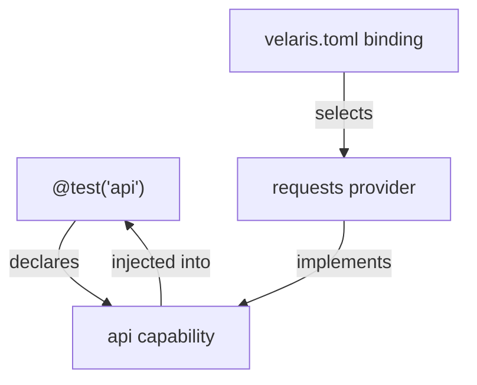
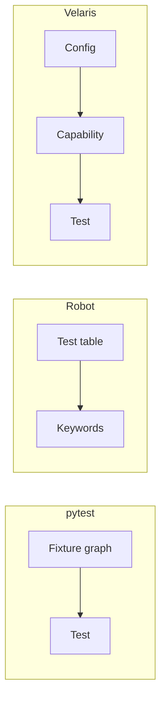

# How Velaris Is Different

Three frameworks. Three mental models. Same goal: run tests with the dependencies they need.

This page is not a feature comparison or a migration guide. It is about **where wiring lives** — in fixtures, in keywords, or in capabilities.

## The one-line models

| Framework | Unit of reuse | Question the test asks |
|-----------|---------------|------------------------|
| **pytest** | Fixture | “What do I inject into this function?” |
| **Robot Framework** | Keyword | “What step do I call next?” |
| **Velaris** | Capability | “What interface am I allowed to depend on?” |

## pytest → Fixtures

In pytest, dependencies are **functions that produce values**. Tests request fixtures by parameter name. Pytest builds a dependency graph and resolves it.

```python
@pytest.fixture
def api_client(base_url):
    return RequestsClient(base_url)

@pytest.fixture
def base_url():
    return "http://testserver"

def test_users(api_client):
    response = api_client.get("/users")
    assert response.status_code == 200
```

**Mental model:** “I need `api_client`. pytest figures out how to build it.”



| Lives in | Role |
|----------|------|
| Fixture functions | Construction + scope |
| Test parameters | Dependency declaration |
| `conftest.py` | Shared setup across files |
| Test code | Assertions |

Fixtures excel at composable Python setup. The graph is implicit — you discover wiring by reading fixture definitions and `conftest.py` chains.

## Robot Framework → Keywords

In Robot, tests are **tables of keyword calls**. Keywords hide implementation. Files organize keywords into resources and libraries.

```robot
*** Test Cases ***
Users List Should Return 200
    Create API Client    http://testserver
    GET    /users
    Status Should Be    200
```

```python
# library or resource keyword
def create_api_client(base_url):
    global client
    client = RequestsClient(base_url)
```

**Mental model:** “I call a keyword. The keyword knows how to do the thing.”



| Lives in | Role |
|----------|------|
| Keywords | Actions and setup steps |
| Test tables | Scenario flow |
| Resource files | Keyword composition |
| Libraries | Python implementation |

Robot excels at readable scenarios for mixed audiences. Wiring is spread across keyword definitions, resources, and variable files.

## Velaris → Capabilities

In Velaris, dependencies are **named interfaces** (capabilities). Tests declare which capabilities they need. Configuration selects **which provider** implements each capability. The runner resolves and injects.

```python
from velaris_core.decorators import test

@test("api")
def test_users(api):
    response = api.get("/users")
    assert response.status_code == 200
```

```toml
# velaris.toml
[capabilities.api]
provider = "requests"

[capabilities.api.options]
base_url = "http://testserver"
```

**Mental model:** “I need the `api` capability. Config decides whether that means `requests`, a mock, or something else.”



| Lives in | Role |
|----------|------|
| Capability contract | Interface the test depends on |
| Provider factory | Implementation (swappable) |
| `velaris.toml` | Binding capability → provider |
| Test code | Declarations + assertions |

Velaris separates **what the test needs** (capability) from **how it is satisfied** (provider + config). The resolver does not build dependency graphs between capabilities — each resolves independently (Model A).

## Same need, three shapes

Goal: call `GET /users` and assert status 200.

| | pytest | Robot | Velaris |
|---|--------|-------|-------|
| **Declare need** | Parameter `api_client` | Keyword `Create API Client` | `@test("api")` + param `api` |
| **Choose implementation** | Fixture body / conftest | Keyword library | `provider = "requests"` in config |
| **Configure environment** | Fixture args, env in setup | Variables, keyword args | `[capabilities.api.options]` |
| **Swap mock vs real** | Change fixture or use `@pytest.mark` | Swap keyword library | Change `provider` in TOML |
| **Where wiring is visible** | Fixture chain | Keyword + resource files | Config file |

None of these is “wrong.” They optimize for different centers of gravity:

- **pytest** centers on **Python composition**
- **Robot** centers on **scenario steps**
- **Velaris** centers on **interface + config binding**

## What moves where



**pytest:** construction logic travels with fixtures.

**Robot:** action logic travels with keywords.

**Velaris:** selection logic travels with config; tests hold stable capability names.

## When the Velaris model helps

The capability model is a fit when you want:

- Tests that name **interfaces** (`api`, `secrets`, `browser`) rather than construction details
- Provider swaps **without editing test code** (env secrets vs static, fake browser vs verbose)
- A strict boundary between **authoring** (Python, YAML, BDD → TestSpec) and **execution** (runner)
- Explicit, observable resolution (`RESOLVE api(requests)` with `--verbose` or `--debug`, or in JSON logs)

The capability model is a poor fit when you need:

- pytest’s mature plugin ecosystem today
- Robot-style plain-language scenarios for non-developers
- Implicit dependency graphs between setup functions

Velaris v0.1.0-alpha is an execution engine exploring this model — not a drop-in replacement for either framework.

## The shift in one sentence

> **pytest asks “how do I build this?” — Robot asks “what step is next?” — Velaris asks “what am I allowed to use?”**

From here:

- [Capabilities](/concepts/capabilities) — what a capability is in Velaris
- [Providers](/concepts/providers) — how implementations plug in
- [Your First Test](/getting-started/first-test) — run something in two minutes
