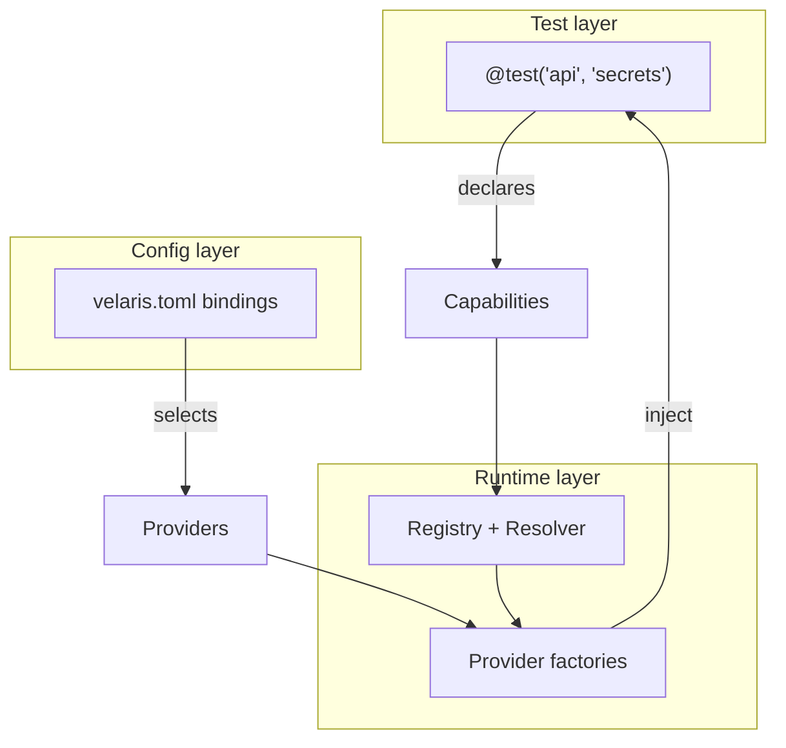

# Concepts Overview

Velaris separates **what tests need** from **how those needs are satisfied**.

## Key terms

| Term | Definition |
|------|------------|
| **Capability** | Named interface a test depends on (`api`, `secrets`, `browser`) |
| **Contract** | Python `Protocol` defining the capability surface |
| **Provider** | Named implementation of a capability (`requests`, `env`, `fake`) |
| **Factory** | Function `(options) → (instance, teardown)` registered in the registry |
| **Binding** | Config entry mapping capability → provider + options |
| **TestSpec** | Format-agnostic test representation consumed by the runner |

## Model A

Capabilities are **independent**. No dependency graph. If `api` needs a URL from `target_environment`, the test wires them in Python or config conventions merge bindings — the resolver never passes instances between factories.

## Topics

- [How Velaris Is Different](/concepts/how-velaris-is-different) — pytest fixtures vs Robot keywords vs capabilities
- [Capabilities](/concepts/capabilities) — contracts and declaration
- [Providers](/concepts/providers) — factories, teardown, events
- [TestSpec IR](/concepts/testspec) — the execution boundary
- [Events & Reporting](/concepts/events) — observability
