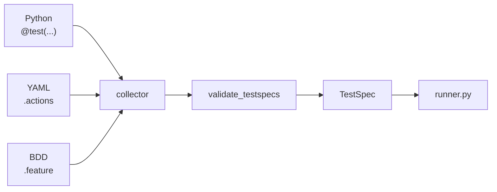

# TestSpec IR

**TestSpec** is the format-agnostic representation of a test. The runner executes TestSpec objects — not Python-specific types.

## Shape

```python
@dataclass(frozen=True)
class TestSpec:
    name: str
    capabilities: list[str]
    callable: Callable[..., Any]
```

| Field | Description |
|-------|-------------|
| `name` | Test function name (must be unique in a run) |
| `capabilities` | Ordered capability IDs to resolve |
| `callable` | Function to invoke with injected kwargs |

## Collection pipeline



Built-in adapters: `PythonAdapter`, `YamlAdapter`, `BddAdapter`. The collector dispatches by file extension.

1. **Discover** — scan paths; route each file to its adapter
2. **Compile** — adapter produces `TestSpec` list
3. **Validate** — unique names, non-empty capabilities, callable present
4. **Execute** — runner resolves and invokes

## Why IR matters

TestSpec decouples execution from authoring format:

- **Python** — `@test` functions with native callables
- **YAML** — `name`, `capabilities`, optional `actions` (serialized capability calls)
- **BDD** — minimal Gherkin; Given/When/Then are the same serialized calls

The runner, resolver, and reporting never import adapter-specific machinery.

## Validation errors

Collection fails fast with `CollectionError`:

```text
Test 'test_foo' declares capability 'api' but has no parameter named 'api'.
Duplicate test name: 'test_checkout'
Path not found: tests/missing.py
```

## Example

```python
@test("browser")
def test_login(browser):
    browser.open("/login")
```

Becomes:

```python
TestSpec(
    name="test_login",
    capabilities=["browser"],
    callable=<function test_login>,
)
```
