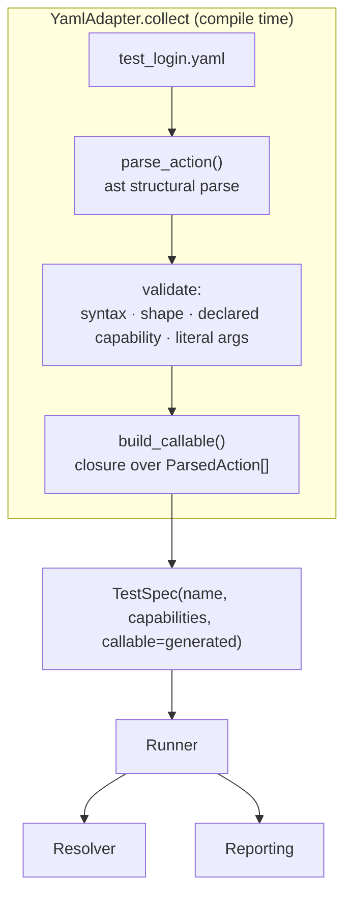

# Executable YAML (Milestone 10)

::: info Milestone report
Shipped in v0.1.0-alpha. For hands-on use see [examples/authoring](/examples/authoring).
:::

| Field | Value |
|-------|-------|
| Milestone | 10 — Executable YAML |
| Date | 2026-06-02 |
| Goal | A non-Python authoring style executes through the existing engine |
| Constraint | Runner, resolver, reporting, and TestSpec unchanged |

**Most important question:** Does executable YAML feel like (A) serialized
capability calls, or (B) the beginning of a keyword engine?

**Answer: A.** Every action is a single capability method call, parsed
structurally (never `eval`'d) and dispatched with one `getattr`. There is no
keyword registry, no step matching, no DSL, and no user-defined functions. The
moment any of those appear, we would be drifting toward B — see
[risks](#7-architectural-risks-discovered).

---

## 1. YAML execution architecture



The adapter is the *only* new code path. Below `TestSpec`, the Python and YAML
flows are the same objects calling the same functions.

What stayed byte-for-byte unchanged: `runner.py`, `resolver.py`,
`reporting.py`, `testspec.py`.

---

## 2. Generated callable design

An action is a **serialized capability call**:

```yaml
actions:
  - browser.open("/login")
  - browser.type("#username", "demo")
```

Parsed (with `ast`, structure only) into:

```python
ParsedAction(capability="browser", method="open",  args=("/login",))
ParsedAction(capability="browser", method="type",  args=("#username", "demo"))
```

Compiled into a closure with the exact shape the runner expects from a Python
test — capabilities arrive as keyword arguments:

```python
def generated_callable(**capabilities):
    for action in actions:
        target = capabilities[action.capability]   # resolved instance
        method = getattr(target, action.method)     # only reflection used
        method(*action.args, **action.kwargs)
```

The runner calls `spec.callable(**{cap: resolved})` regardless of source. It
cannot tell whether `generated_callable` came from Python or YAML.

This is conceptually equivalent to the hand-written Python:

```python
def test_login(browser):
    browser.open("/login")
    browser.type("#username", "demo")
```

---

## 3. Example YAML tests

`examples/authoring/tests/test_login.yaml`:

```yaml
name: test_login_yaml

capabilities:
  - browser

actions:
  - browser.open("/login")
  - browser.type("#username", "demo")
  - browser.click("#submit")
```

Declaration-only YAML (Milestone 9) still works — omit `actions` and the test
uses the default no-op body. See `examples/authoring/tests/test_random.yaml`.

Run both authoring styles together:

```bash
cd examples/authoring
velaris run tests/
```

---

## 4. Event flow comparison (Python vs YAML)

The Python test (`test_login.py`) and the YAML test (`test_login.yaml`) emit
**identical** event streams. Only the test name differs.

| Step | Python (`test_login`) | YAML (`test_login_yaml`) |
|------|----------------------|--------------------------|
| TestStarted | ✓ | ✓ |
| CapabilityResolved `browser(fake)` | ✓ | ✓ |
| CapabilityObserved `open {path:/login}` | ✓ | ✓ |
| CapabilityObserved `type {path:#username, text:demo}` | ✓ | ✓ |
| CapabilityObserved `click {path:#submit}` | ✓ | ✓ |
| TestPassed | ✓ | ✓ |
| CapabilityObserved `close` (teardown) | ✓ | ✓ |
| CapabilityTeardown `browser` | ✓ | ✓ |

Captured JSON (`--json-log`), names elided:

```json
{"type": "CapabilityObserved", "capability": "browser", "action": "open",  "data": {"path": "/login"}}
{"type": "CapabilityObserved", "capability": "browser", "action": "type",  "data": {"path": "#username", "text": "demo"}}
{"type": "CapabilityObserved", "capability": "browser", "action": "click", "data": {"path": "#submit"}}
```

The test `test_python_and_yaml_actions_emit_identical_events` asserts this
parity programmatically.

---

## 5. LOC impact

| Area | Lines | Note |
|------|-------|------|
| `adapters/yaml_actions.py` (new) | 128 | parser + callable generator |
| `adapters/yaml_adapter.py` | +29 | optional `actions` compilation |
| `tests/test_adapters.py` | +~95 | compile errors + event parity |
| `runner.py` / `resolver.py` / `reporting.py` / `testspec.py` | **0** | unchanged |
| `examples/authoring/` | +2 tests, +1 binding | Python + YAML login demo |

Executable YAML cost ~160 lines of adapter code and **zero** lines of engine
change.

---

## 6. Error handling

| Error | When | Surfaced as |
|-------|------|-------------|
| Invalid action syntax | compile (collection) | `CollectionError` |
| Action is not `capability.method(...)` | compile | `CollectionError` |
| Unknown capability (not declared) | compile | `CollectionError` |
| Non-literal argument | compile | `CollectionError` |
| Unknown method | execution | `VelarisError` → `TestFailed` |
| Invalid argument count | execution | `VelarisError` → `TestFailed` |

Structural errors are caught at collection. Method existence and argument count
depend on the **resolved capability instance**, which does not exist until the
runner resolves the provider — so they surface at execution as ordinary test
failures through the unchanged reporting path (clear, capability-centric
messages). See [risk 2](#7-architectural-risks-discovered).

---

## 7. Architectural risks discovered

1. **Compile-time validation is shallow by design.** The adapter knows the
   capability *name* but not its *interface* (the contract Protocol is not
   resolved until runtime). So "unknown method" and "wrong argument count" can
   only be caught at execution. Catching them earlier would require a
   capability→contract registry — a new subsystem that pulls toward B.

2. **Stringly-typed actions are fragile.** `browser.open("/login")` is text
   until it runs. A typo in a method name is a runtime failure, not a static
   one. This is acceptable for serialized calls but does not scale to large
   suites without tooling (a linter, schema, or IDE plugin).

3. **Arguments are literals only.** No variables, no references, no captured
   return values. `token = api.login(); api.get(token)` is impossible in YAML.
   This is the wall between "serialized calls" (A) and "a language" (B). The
   first feature request to cross it (variables) is the one to refuse.

4. **No data flow between actions.** Each action is fire-and-forget. Anything
   needing state across steps (assert on a return value, branch on a result)
   has no home in this model — and adding one means inventing expressions,
   bindings, and scope: a DSL.

5. **`ast` parsing accepts more than we use.** We parse full Python call
   syntax then reject non-literals. This is convenient but means the "grammar"
   is implicitly "a subset of Python," which is under-specified. A future
   formal grammar would make the boundary explicit.

6. **The engine boundary held.** TestSpec did not change. Executable YAML fit
   entirely inside the adapter because a test body is just `callable(**caps)`.
   This is the strongest evidence the architecture is sound: a second authoring
   style became executable with zero engine edits.

---

## Verdict: A, not B

Executable YAML is **serialized capability calls**. The proof:

- One action = one capability method call. No composition, no naming, no reuse.
- Dispatch is a single `getattr`. No registry, no matching, no indirection.
- Arguments are literals. No variables means no language.
- The generated callable is indistinguishable from a Python test body.

It would *become* B the moment we add any of: variables, return-value capture,
conditionals, loops, or user-named steps. Those are explicitly out of scope, and
the risks above mark exactly where the line is. As long as YAML stays a
*serialization of capability calls*, Velaris keeps one execution engine.
