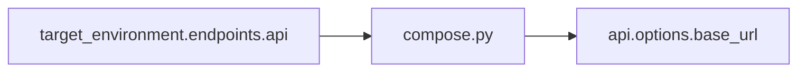

# target_environment@0.1

Named test environment with endpoint map. Often used for **config composition** rather than direct test injection.

## Contract

```python
from velaris_contracts.target_environment.v0_1 import TargetEnvironment
```

| Member | Description |
|--------|-------------|
| `environment` | Environment name (e.g. `staging`) |
| `endpoint(name)` | URL for named endpoint (raises `KeyError` if missing) |

## Provider

### `static`

```toml
[capabilities.target_environment]
provider = "static"

[capabilities.target_environment.options]
environment = "local"

[capabilities.target_environment.options.endpoints]
api = "https://api.local.test"
```

## Direct test usage

```python
@test("target_environment")
def test_env(target_environment):
    assert target_environment.environment == "local"
    assert target_environment.endpoint("api") == "https://api.local.test"
```

## Bootstrap composition

When `api.options.base_url` is unset, `compose.py` copies `target_environment.endpoints.api`:



Test declares only `@test("api", "secrets")` — URL comes from config merge.

See [Model A Composition](/architecture/model-a) and [Composition example](/examples/composition).

## Events

No runtime observations in alpha. Used primarily for config-level wiring.
