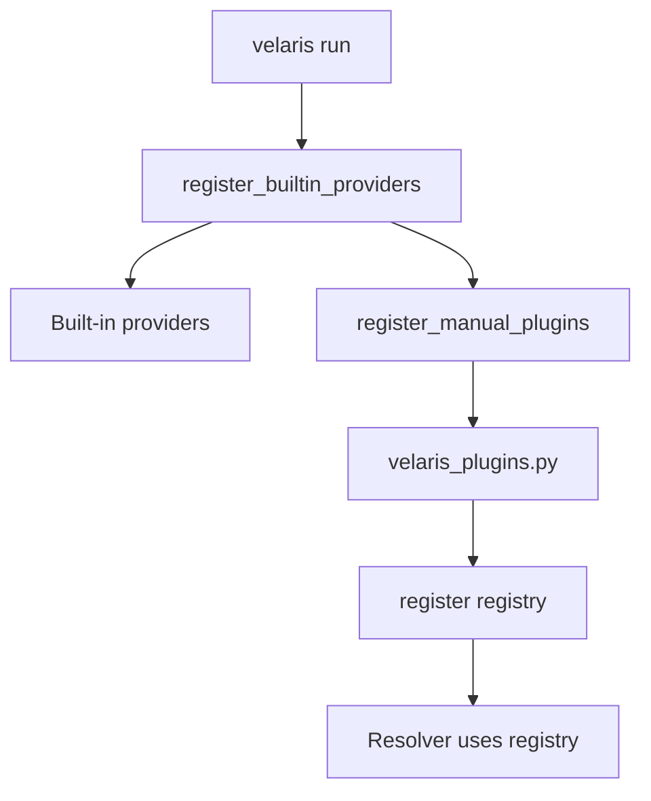

# Plugin Author Guide

Add a capability to Velaris without reading framework internals. Import **only** from `velaris_core.sdk`.

## SDK reference

| Symbol | Purpose |
|--------|---------|
| `Registry` | Register `(capability_id, provider) → factory` |
| `ProviderFactory` | `(options: dict) -> (instance, teardown)` |
| `Teardown` | Post-test cleanup callable |
| `pop_emit` | Extract internal emit callback from options |
| `capability_observed` | Build observation events |
| `register_manual_plugins` | Load `velaris_plugins.py` explicitly (advanced) |

## Five steps

### 1. Define a contract

```python
# clock/contract.py
from typing import Protocol, runtime_checkable

CAPABILITY_ID = "clock"
CONTRACT_VERSION = "0.1"

@runtime_checkable
class Clock(Protocol):
    def now(self) -> str: ...
```

Keep contracts in **your** package. Publish to `velaris-contracts` only if you want a shared contract package.

### 2. Implement a provider factory

```python
# clock/provider.py
from velaris_core.sdk import Teardown, capability_observed, pop_emit

class FixedClock:
    def __init__(self, fixed_time: str, emit=None):
        self._fixed_time = fixed_time
        self._emit = emit

    def now(self) -> str:
        if self._emit:
            self._emit(capability_observed("clock", "now", {"value": self._fixed_time}))
        return self._fixed_time

def create_fixed_clock(options):
    cleaned, emit = pop_emit(options)
    fixed_time = str(cleaned.get("fixed_time", "2026-01-01T00:00:00Z"))
    return FixedClock(fixed_time, emit=emit), lambda: None
```

### 3. Register manually

```python
# velaris_plugins.py  (project root, next to velaris.toml)
from velaris_core.sdk import Registry
from clock.provider import create_fixed_clock

def register(registry: Registry) -> None:
    registry.register("clock", "fixed", create_fixed_clock)
```

No entry points. No auto-discovery. Registration is explicit.

### 4. Bind in config

```toml
[capabilities.clock]
provider = "fixed"

[capabilities.clock.options]
fixed_time = "2026-06-02T12:00:00Z"
```

### 5. Write tests

```python
from velaris_core.decorators import test

@test("clock")
def test_fixed_time(clock):
    assert clock.now() == "2026-06-02T12:00:00Z"
```

```bash
cd my-project   # must contain velaris.toml + velaris_plugins.py
velaris run tests/
```

## Registration flow



::: warning Working directory
Run `velaris run` from the directory containing `velaris_plugins.py`. Running elsewhere silently skips plugin registration.
:::

## What you do not modify

| Module | Plugin author |
|--------|---------------|
| `runner.py` | Do not modify |
| `resolver.py` | Do not modify |
| `reporting.py` | Do not modify |
| `bootstrap.py` | Do not modify |

## Naming tips

- Avoid Python stdlib module names for capability IDs (`random` → use param name `random`, package folder `rng/`)
- Provider string in TOML must exactly match `registry.register(..., "provider", ...)`

## Working examples

- [Plugins (clock)](/examples/plugins)
- [Stress test (database, filesystem, random)](/examples/stress-test)

## Out of scope (alpha)

- Plugin discovery / setuptools entry points
- Dependency graphs between capabilities
- Packaging automation for third-party wheels
