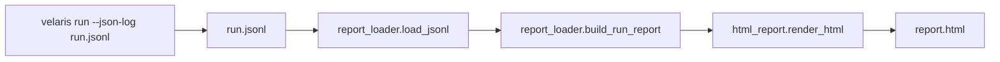

# Static HTML Report (Milestone 13)

::: info Milestone report
Shipped in v0.1.0-alpha. Quick start: [examples/reporting](/examples/reporting) or `velaris run --html-report`.
:::

| Field | Value |
|-------|-------|
| Milestone | 13 — Static HTML Report |
| Date | 2026-06-02 |
| Goal | Beautiful static HTML from JSON event logs |
| Constraint | No runner/resolver/event model changes; JSON logs only |

**Question:** Does the current Velaris event model provide enough information for a useful HTML report?

**Answer:** Yes. The existing JSON log already carries everything v1 needs: per-test correlation (`test` field), pass/fail with messages, session summary (`RunFinished`), capability resolution, observations, and teardown. No event model extension was required.

---

## 1. Report architecture



This pipeline is **fully offline**. It does not import the runner, resolver, or registry. It only reads JSON produced by a prior run.

| Module | Role |
|--------|------|
| `report_loader.py` | Parse JSONL → `RunReport` / `TestReport` / `TimelineEvent` |
| `html_report.py` | Render self-contained HTML (CSS + JS embedded) |
| `cli.py` | `velaris report` command |

---

## 2. HTML generation flow

1. **Load** — Read each line of `run.jsonl` as JSON; validate `type` field.
2. **Aggregate** — Group events by `test` name; extract `RunFinished` for summary.
3. **Timeline** — Map `CapabilityResolved`, `CapabilityObserved`, `CapabilityTeardown` into human-readable timeline entries.
4. **Render** — Emit a single HTML file with:
   - Summary cards (total, passed, failed, duration)
   - Test list (click to select)
   - Detail panel (failure message + capability timeline)
5. **Interact** — Minimal inline JavaScript toggles test detail (no server, no build step).

---

## 3. Example report

A pre-generated example lives at:

`examples/reporting/report.example.html`

Generate your own:

```bash
cd examples/browser
velaris run tests/ --config velaris.fake.toml --json-log run.jsonl
velaris report run.jsonl
open report.html
```

### What it looks like

- **Header** — “Velaris Test Report” with duration subtitle
- **Summary cards** — Total / Passed (green) / Failed (red) / Duration (cyan)
- **Two-column layout** — Test list on the left, detail on the right
- **Test list** — Status dot, monospace test name, pass/fail badge
- **Detail view** — For failures: error type + message in a red box; for all tests: capability event timeline (`Resolve browser`, `browser.open`, `browser.type`, …)

Open `examples/reporting/report.example.html` in a browser to review the full layout (dark theme, Velaris brand colors).

---

## 4. CLI command design

```bash
velaris report <json-log> [-o report.html]
```

| Argument | Default | Description |
|----------|---------|-------------|
| `json_log` | (required) | Path to JSON-lines file from `velaris run --json-log` |
| `-o`, `--output` | `report.html` | Output HTML path |

Exit code `0` on success; prints `Report written to <path>`.

Typical workflow:

```bash
velaris run tests/ --json-log run.jsonl
velaris report run.jsonl
```

---

## 5. LOC impact

| Area | Lines | Note |
|------|-------|------|
| `report_loader.py` (new) | ~155 | JSONL load + aggregation |
| `html_report.py` (new) | ~280 | Template + render |
| `cli.py` | +20 | `report` subcommand |
| `errors.py` | 0 | Unchanged |
| `tests/test_html_report.py` (new) | ~130 | Unit + e2e |
| `runner.py` / `resolver.py` / `events.py` / `json_reporter.py` | **0** | Unchanged |

~590 lines total; zero changes to the execution engine or event emission.

---

## 6. Risks discovered

1. **Report quality depends on `--json-log`.** Default runs do not produce a log. Users must remember to pass `--json-log` during the run; the report command cannot reconstruct events from stdout.

2. **No timestamps in events.** Timeline order follows log line order, which is sufficient for v1 but prevents duration-per-step or latency analysis without extending the event model.

3. **Legacy log formats.** Logs using pre-M10 `CapabilityEvent` (without `test` correlation) are skipped by the loader. Use current `--json-log` output; see `examples/reporting/run.example.jsonl`.

4. **Single-run scope.** One JSONL file = one report. Historical trends, flaky-test tracking, and cross-run comparison are explicitly out of scope (no database, no server).

5. **Self-contained HTML size.** Large suites embed all test data in one file. For thousands of tests, pagination or external JSON would be needed — not required for v1.

6. **The event model was enough.** v1 did not need new fields. The `test` correlation field and structured `CapabilityObserved.data` were the critical enablers. Failure formatting benefited from Milestone 11's `error_type` on `TestFailed` in JSON output.

---

## Verdict

Velaris can produce a useful, readable static HTML report from today's JSON logs alone. The report layer is a pure consumer — validation that the event model was designed well enough for downstream tooling without coupling report generation to execution.
