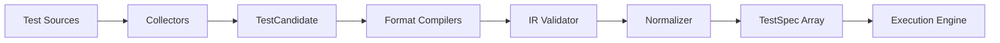

# RFC-002: TestSpec Internal Representation (IR)

::: info Historical design reference
Written during early planning. Python, YAML, and BDD adapters now compile to `TestSpec` — see [authoring styles](/authoring-styles). For current behavior, prefer [execution pipeline](/architecture/execution-pipeline).
:::

| Field | Value |
|-------|-------|
| Status | Draft |
| Created | 2026-06-02 |
| Authors | Velaris Core Team |
| Reviewers | TBD (platform engineers) |

## Summary

This RFC defines the **TestSpec IR** — the canonical internal representation of a test that Velaris executes. All authoring formats (Python, YAML, Gherkin) compile into TestSpec. The execution engine operates exclusively on TestSpec and never depends on how a test was written.

## Motivation

Velaris supports multiple authoring styles over time. Without a shared IR:

- Each format would invoke the engine differently
- Capability injection, parametrization, and reporting would be duplicated
- Parallel scheduling would need format-specific logic

TestSpec is the **contract between adapters and the engine**.

## Design principles

1. **Format-agnostic** — IR fields have no Python/YAML/Gherkin syntax embedded
2. **Stable schema** — Versioned with backward-compatible additions
3. **Inspectable** — `velaris collect --dry-run` emits IR as JSON for debugging
4. **Minimal but complete** — Contains everything needed to schedule, resolve capabilities, execute, and report
5. **Serializable** — Required for parallel workers (Phase 5) and future distributed execution

## IR schema version

```json
{
  "ir_version": "1.0",
  ...
}
```

Schema changes follow semver on `ir_version`. Engine accepts `ir_version` within its supported range.

## Core types

### TestSpec

The atomic unit of execution.

```json
{
  "ir_version": "1.0",
  "id": "tests/api/test_users.py::test_list_users",
  "name": "test_list_users",
  "display_name": "List users returns 200",
  "authoring": {
    "format": "python",
    "source_file": "tests/api/test_users.py",
    "source_line": 12,
    "source_column": 0
  },
  "required_capabilities": [
    {
      "id": "api",
      "contract": "api@0.1",
      "scope": "test"
    }
  ],
  "parameters": [],
  "tags": ["api", "smoke"],
  "markers": {
    "skip": false,
    "xfail": false,
    "timeout_seconds": 60
  },
  "executable": {
    "kind": "python_callable",
    "ref": "tests.api.test_users:test_list_users"
  },
  "metadata": {}
}
```

### Field reference

| Field | Type | Required | Description |
|-------|------|----------|-------------|
| `ir_version` | string | yes | IR schema version |
| `id` | string | yes | Globally unique test identifier |
| `name` | string | yes | Short name (function/scenario name) |
| `display_name` | string | no | Human-readable label for reports |
| `authoring` | AuthoringRef | yes | Source location and format |
| `required_capabilities` | CapabilityRef[] | yes | Dependencies to inject (may be empty) |
| `parameters` | ParameterSet[] | yes | Parametrization variants (empty = single run) |
| `tags` | string[] | yes | Filterable labels |
| `markers` | Markers | yes | Execution modifiers |
| `executable` | Executable | yes | What to run |
| `metadata` | object | yes | Extensible key-value (plugin-defined) |

### AuthoringRef

```json
{
  "format": "python",
  "source_file": "tests/api/test_users.py",
  "source_line": 12,
  "source_column": 0
}
```

`format` enum: `python` | `yaml` | `gherkin` | `plugin` (for custom collectors)

### CapabilityRef

```json
{
  "id": "api",
  "contract": "api@0.1",
  "scope": "test"
}
```

| Field | Description |
|-------|-------------|
| `id` | Capability injection name |
| `contract` | Required contract version (resolved at collection if omitted in source) |
| `scope` | Requested scope override; null = provider default |

### ParameterSet

Supports parametrized tests. Each entry produces a distinct scheduled test run.

```json
{
  "id_suffix": "status_code=404",
  "values": {
    "path": "/users/missing",
    "expected_status": 404
  },
  "tags": [],
  "markers": {}
}
```

Scheduled test ID becomes: `{base_id}[{id_suffix}]`

### Markers

```json
{
  "skip": false,
  "skip_reason": null,
  "xfail": false,
  "xfail_reason": null,
  "timeout_seconds": 60,
  "fail_fast": null
}
```

### Executable

Discriminated union by `kind`:

#### `python_callable`

```json
{
  "kind": "python_callable",
  "ref": "tests.api.test_users:test_list_users"
}
```

`ref` format: `{module_path}:{callable_name}` — resolved by Python adapter at execution time.

#### `step_sequence`

Used by YAML/BDD adapters (Phase 6). Ordered list of steps.

```json
{
  "kind": "step_sequence",
  "steps": [
    {
      "id": "step-1",
      "name": "Open login page",
      "action": "browser.open",
      "arguments": { "url": "/login" },
      "required_capabilities": ["browser"]
    },
    {
      "id": "step-2",
      "name": "Click login button",
      "action": "browser.click",
      "arguments": { "selector": "#login-btn" },
      "required_capabilities": ["browser"]
    }
  ]
}
```

`action` maps to a registered step handler provided by capability plugins.

#### `plugin`

Escape hatch for custom execution:

```json
{
  "kind": "plugin",
  "plugin_id": "custom-runner",
  "handler": "run_load_test",
  "arguments": {}
}
```

## Collection pipeline



### TestCandidate (internal, pre-IR)

Lightweight discovery result before full compilation:

```json
{
  "source_file": "tests/api/test_users.py",
  "format": "python",
  "raw_ref": "test_list_users",
  "collector": "python-default"
}
```

### Validation rules

The IR validator rejects:

- Duplicate `id` values within a session
- `executable.kind` values unknown to loaded plugins
- `required_capabilities` referencing unknown capability IDs (warning at collect, error at run if unresolved)
- `step_sequence` steps with actions not registered by any plugin
- Invalid `ir_version`

### Normalization

- Generate `id` if missing (from source location + name)
- Apply default `markers.timeout_seconds` from config
- Merge tag inheritance (module-level → test-level)
- Resolve `contract` version from config if not specified in source

## Example tests in IR

### Example 1: Unit test (no capabilities)

Python source:

```python
def test_addition():
    assert 1 + 1 == 2
```

TestSpec IR:

```json
{
  "ir_version": "1.0",
  "id": "tests/unit/test_math.py::test_addition",
  "name": "test_addition",
  "display_name": null,
  "authoring": {
    "format": "python",
    "source_file": "tests/unit/test_math.py",
    "source_line": 1,
    "source_column": 0
  },
  "required_capabilities": [],
  "parameters": [],
  "tags": ["unit"],
  "markers": {
    "skip": false,
    "xfail": false,
    "timeout_seconds": 30
  },
  "executable": {
    "kind": "python_callable",
    "ref": "tests.unit.test_math:test_addition"
  },
  "metadata": {}
}
```

### Example 2: API integration test

Python source:

```python
from velaris_contract_api.v0_1 import ApiClient

@velaris.tag("api", "smoke")
def test_list_users(api: ApiClient) -> None:
    response = api.get("/users")
    assert response.status_code == 200
    assert len(response.json()) > 0
```

TestSpec IR:

```json
{
  "ir_version": "1.0",
  "id": "tests/api/test_users.py::test_list_users",
  "name": "test_list_users",
  "display_name": null,
  "authoring": {
    "format": "python",
    "source_file": "tests/api/test_users.py",
    "source_line": 5,
    "source_column": 0
  },
  "required_capabilities": [
    {
      "id": "api",
      "contract": "api@0.1",
      "scope": "test"
    }
  ],
  "parameters": [],
  "tags": ["api", "smoke"],
  "markers": {
    "skip": false,
    "xfail": false,
    "timeout_seconds": 60
  },
  "executable": {
    "kind": "python_callable",
    "ref": "tests.api.test_users:test_list_users"
  },
  "metadata": {}
}
```

### Example 3: UI test (browser capability)

Python source:

```python
from velaris_contract_browser.v1_0 import Browser

@velaris.tag("ui", "login")
def test_login(browser: Browser) -> None:
    with velaris.step("Open login page"):
        browser.open("/login")
    with velaris.step("Submit credentials"):
        browser.fill("#username", "user@example.com")
        browser.fill("#password", "secret")
        browser.click("#login-btn")
    with velaris.step("Verify dashboard"):
        assert browser.is_visible("#dashboard")
```

TestSpec IR:

```json
{
  "ir_version": "1.0",
  "id": "tests/ui/test_login.py::test_login",
  "name": "test_login",
  "display_name": null,
  "authoring": {
    "format": "python",
    "source_file": "tests/ui/test_login.py",
    "source_line": 5,
    "source_column": 0
  },
  "required_capabilities": [
    {
      "id": "browser",
      "contract": "browser@1.0",
      "scope": "test"
    }
  ],
  "parameters": [],
  "tags": ["ui", "login"],
  "markers": {
    "skip": false,
    "xfail": false,
    "timeout_seconds": 120
  },
  "executable": {
    "kind": "python_callable",
    "ref": "tests.ui.test_login:test_login"
  },
  "metadata": {
    "steps_declared_in_source": true
  }
}
```

Note: Steps declared via `velaris.step()` in Python are runtime reporting constructs, not IR `step_sequence`. The IR records metadata hint; step events emit during execution.

### Example 4: Parametrized API test

Python source:

```python
@velaris.parametrize("path,expected_status", [
    ("/users", 200),
    ("/users/missing", 404),
])
def test_user_endpoints(api: ApiClient, path: str, expected_status: int) -> None:
    response = api.get(path)
    assert response.status_code == expected_status
```

Produces two TestSpec entries (expanded at collection):

```json
[
  {
    "ir_version": "1.0",
    "id": "tests/api/test_users.py::test_user_endpoints[path=/users]",
    "name": "test_user_endpoints",
    "required_capabilities": [{"id": "api", "contract": "api@0.1", "scope": "test"}],
    "parameters": [{"id_suffix": "path=/users", "values": {"path": "/users", "expected_status": 200}}],
    "executable": {"kind": "python_callable", "ref": "tests.api.test_users:test_user_endpoints"},
    "...": "..."
  },
  {
    "ir_version": "1.0",
    "id": "tests/api/test_users.py::test_user_endpoints[path=/users/missing]",
    "name": "test_user_endpoints",
    "parameters": [{"id_suffix": "path=/users/missing", "values": {"path": "/users/missing", "expected_status": 404}}],
    "...": "..."
  }
]
```

### Example 5: YAML declarative (Phase 6 preview)

YAML source:

```yaml
test: login
tags: [ui, smoke]
capabilities:
  browser: browser@1.0
steps:
  - name: Open login page
    browser.open: /login
  - name: Click login
    browser.click: "#login-btn"
  - name: Verify dashboard
    browser.assert_visible: "#dashboard"
```

TestSpec IR:

```json
{
  "ir_version": "1.0",
  "id": "tests/ui/login.yaml::login",
  "name": "login",
  "display_name": "login",
  "authoring": {
    "format": "yaml",
    "source_file": "tests/ui/login.yaml",
    "source_line": 1,
    "source_column": 0
  },
  "required_capabilities": [
    {"id": "browser", "contract": "browser@1.0", "scope": "test"}
  ],
  "parameters": [],
  "tags": ["ui", "smoke"],
  "markers": {"skip": false, "xfail": false, "timeout_seconds": 120},
  "executable": {
    "kind": "step_sequence",
    "steps": [
      {"id": "step-1", "name": "Open login page", "action": "browser.open", "arguments": {"url": "/login"}, "required_capabilities": ["browser"]},
      {"id": "step-2", "name": "Click login", "action": "browser.click", "arguments": {"selector": "#login-btn"}, "required_capabilities": ["browser"]},
      {"id": "step-3", "name": "Verify dashboard", "action": "browser.assert_visible", "arguments": {"selector": "#dashboard"}, "required_capabilities": ["browser"]}
    ]
  },
  "metadata": {}
}
```

## TestSuite (collection result)

Collection produces a `TestSuite` wrapping all TestSpecs:

```json
{
  "ir_version": "1.0",
  "session_id": "uuid",
  "collected_at": "2026-06-02T10:00:00Z",
  "tests": [ "...TestSpec[]..." ],
  "collection_stats": {
    "total": 42,
    "deselected": 3,
    "errors": 0
  },
  "collection_errors": []
}
```

## Python adapter (Phase 1)

Collection rules for Python:

1. Discover files matching `discovery.patterns` (default: `test_*.py`, `*_test.py`)
2. Import module via isolated loader (plugin-mediated)
3. Find callables matching `discovery.test_name_pattern` (default: `test_*`)
4. Inspect function signature for capability parameters (typed or annotated)
5. Read decorators: `@velaris.tag`, `@velaris.parametrize`, `@velaris.skip`, etc.
6. Emit TestSpec IR

Capability parameters are detected by:
- Type annotation referencing a known Protocol from a `velaris-contract-*` package, OR
- Parameter name matching a registered capability ID with explicit `@velaris.capability("api")` annotation

## CLI inspection

```bash
# Emit collected IR as JSON
velaris collect --dry-run --format json

# Validate IR schema without executing
velaris collect --validate-only

# Filter by tag before execution
velaris run --tag api --collect-only
```

## Extensibility

Plugins may extend IR via:

- `metadata` object keys (namespaced: `plugin_name.key`)
- New `executable.kind` values (registered with schema)
- Custom collectors producing TestCandidate → compiler chain

Plugins may NOT modify core IR fields without an IR version bump RFC.

## Non-goals (this RFC)

- Execution scheduling algorithm
- Capability resolution (see RFC-001)
- Reporting event payload (see RFC-005)
- JSON Schema file generation (follows in Phase 1 as `schemas/testspec-1.0.json`)

## Open questions

1. Should `step_sequence` actions be namespaced (`browser.open`) or flat with capability binding per step?
   - **Proposal:** Namespaced by capability ID for clarity.

2. IR storage for large suites (10k+ tests)?
   - **Proposal:** Stream JSON lines in Phase 5; in-memory for Phase 1-4.

## Exit criteria (RFC-002)

- [ ] Unit, API, and UI examples reviewed and represent real platform team tests
- [ ] IR validator rules documented
- [ ] Python adapter mapping clear enough for Phase 1 implementation
- [ ] YAML example marked Phase 6 but schema accommodates it now

## References

- [RFC-001: Capability Model](./RFC-001-capability-model.md)
- [RFC-006: pytest Coexistence](../archive/rfc/RFC-006-pytest-coexistence.md)
- [api@0.1 Contract](../contracts/api-0.1.md)
